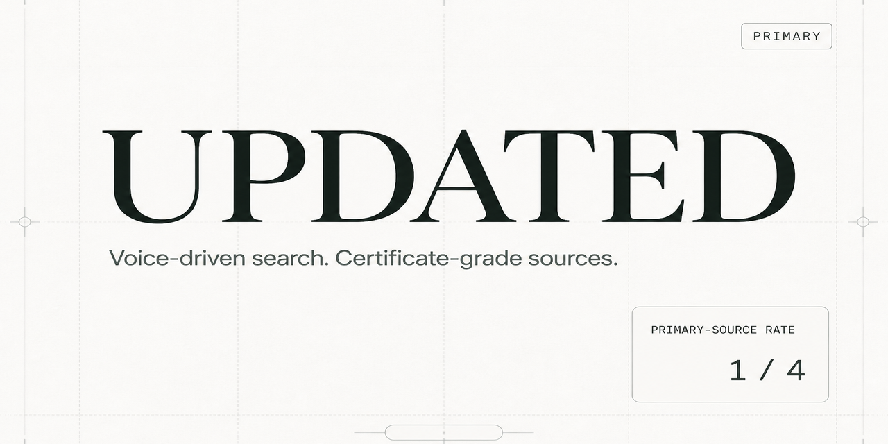
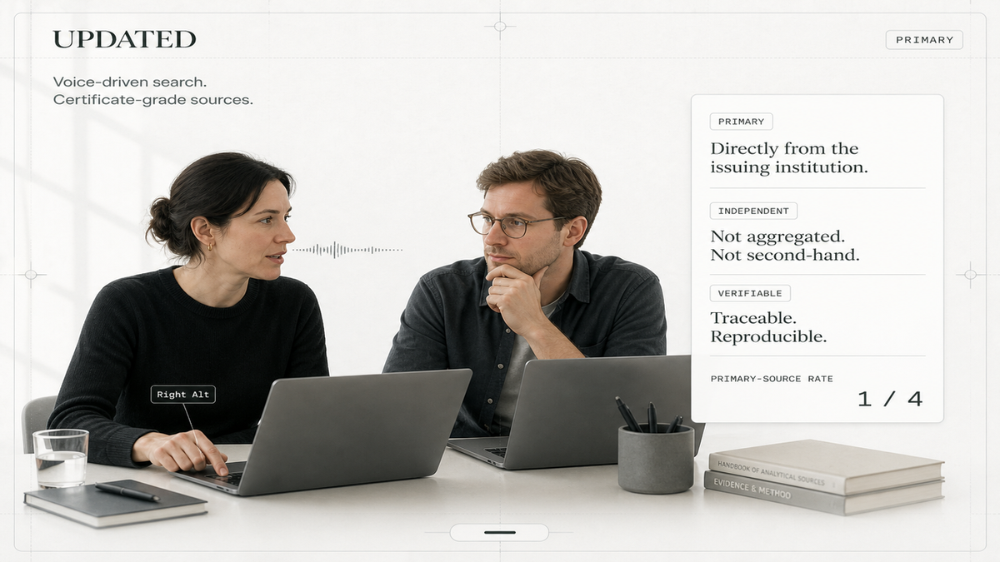
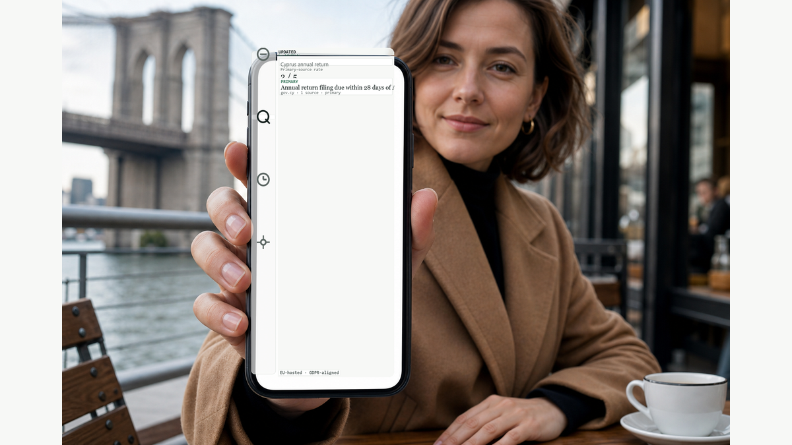
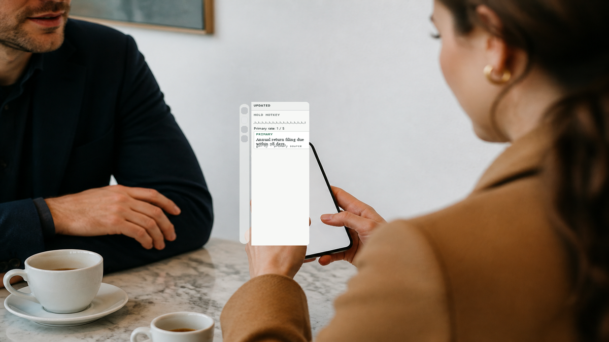
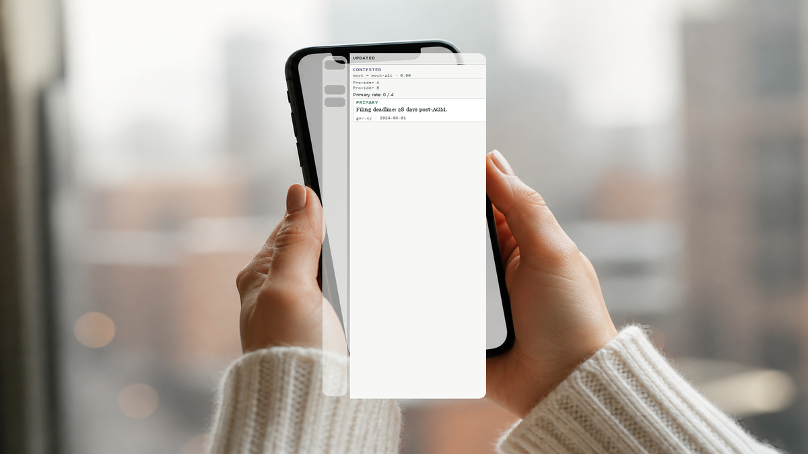

<p align="center">
  
</p>

<p align="center">
  <a href="LICENSE"></a>
  
  
  <a href="docs/ARCHITECTURE-MAP.md"></a>
</p>

# UPDATED

**Hold a hotkey. Speak a question. Read the sources.**

UPDATED is a desktop search instrument: voice in, certificate-style claim cards out — with a plain primary-source rate and an honest CONTESTED state when providers diverge.

Fork of [Freestyle](https://github.com/freestyle-voice/freestyle). Product name and design system are UPDATED; the dictation paste path remains intact.

---

## What it is

| Surface | Behavior |
|---------|----------|
| **Dictation mode** | Hold hotkey → mic → STT → paste/clipboard (unchanged Freestyle path) |
| **Search mode** | Hold hotkey → mic → STT → multi-provider search → claim cards in the panel |
| **Claim cards** | Newsreader claim text, Martian Mono state chips, hairline source strip |
| **Primary-source rate** | Stated as `primary / total` — including `0 / N` and “No primary sources found.” |
| **CONTESTED** | Jaccard similarity across providers below 0.35 — results never merged or voted |
| **Settings** | Live hotkey rebind, input mode, Brave API key (encrypted), dual/single providers, divergence log reveal |

Design tokens live in `packages/updated-design` — paper, ink, graphite, 2px radius, 0.5px hairlines. No glassmorphism.

---

## Usage

Hold the dictation hotkey (default **Right Alt**), speak your question, then read claim cards in the panel **Search** tab. In **Search** input mode the same hotkey routes STT output to search instead of paste.

<p align="center">
  
  <br />
  <sub>Hold hotkey → speak → claim cards (Search mode). Illustration uses UPDATED paper/ink tokens; not a live app screenshot.</sub>
</p>

<p align="center">
  
  <br />
  <sub>Certificate cards: PRIMARY chip, source count and date strip, CONTESTED when dual providers diverge (mock pair without a Brave key).</sub>
</p>

Typed queries in the Search tab work the same way — voice is the primary path shown here.

### Mobile

Same flow on phone: hold the hotkey, speak, read claim cards. Hybrid UI below — glass nav rail + certificate Search content, composited inside the phone screen. **Mobile client is a concept**; the hybrid shell + certificate Search tab is **shipped in the Electron panel** (commit `2060245`).

<p align="center">
  
  <br />
  <sub>Café interview — glass rail, certificate claim cards, primary rate 2/5 (screen-mask compositor).</sub>
</p>

<p align="center">
  
  <br />
  <sub>Over-shoulder — hold hotkey, voice waveform, primary rate 1/5.</sub>
</p>

<p align="center">
  
  <br />
  <sub>Hands hero — CONTESTED state, provider sections, PRIMARY card clipped in screen.</sub>
</p>

---

## Quick start

```powershell
git clone https://github.com/AGiOS-Ai-EU/UPDATED.git
cd UPDATED
pnpm install
pnpm --filter @freestyle-voice/electron run compile:native
pnpm --filter @freestyle-voice/electron run dev
```

**Windows notes**

- Default dictation hotkey is **Right Alt** (see Settings → Dictation to rebind live).
- Native helpers need a working C++ toolchain for `compile:native` on first run.
- Without a Brave Search API key, dual **mock** providers demonstrate CONTESTED results in the Search tab.

Optional: Settings → Search → paste a Brave Search key → Save (stored via Electron `safeStorage`, never in SQLite).

---

## Features (Gates 1–7)

- Certificate design system (Newsreader / Instrument Sans / Martian Mono)
- Bottom-centre widget positioning with per-display persistence
- Search contracts + Brave HTTP provider + mock / mock-alt pair
- Panel **Search** tab with claim cards, age strip, primary-source rate
- Divergence detection + JSONL log at `{userData}/logs/search-divergence.jsonl`
- Settings: hotkey rebind, mode switch, Brave key, provider dual/single, log reveal
- **Search query history** — last 30 queries in the Search tab (CONTESTED flag + primary rate); click to re-run; stored locally in `{userData}/search-query-history.json`

Architecture: [`docs/ARCHITECTURE-MAP.md`](docs/ARCHITECTURE-MAP.md) · Search: [`docs/SEARCH-ARCHITECTURE.md`](docs/SEARCH-ARCHITECTURE.md) · Roadmap: [`docs/ROADMAP.md`](docs/ROADMAP.md) · Changelog: [`docs/CHANGES.md`](docs/CHANGES.md)

Vector banner (crisp): [`docs/assets/updated-github-hero.svg`](docs/assets/updated-github-hero.svg)

---

## Not yet wired

Honest backlog for later gates (see [`docs/ROADMAP.md`](docs/ROADMAP.md)):

- Modifier + hotkey flip for input mode (settings / Search tab toggles exist today)
- Third live search provider (e.g. Exa)
- Divergence CSV / in-app log viewer (reveal + copy path only)
- LLM claim extraction (one card per citation + summary today)
- Single merged widget window (still companion + panel + notification)
- Export search results (JSON/CSV)

---

## License

[MIT](LICENSE) — same license as the upstream Freestyle checkout in this repository.

## Credits

UPDATED is a fork of [freestyle-voice/freestyle](https://github.com/freestyle-voice/freestyle). Upstream product names (`@freestyle-voice/*` packages) are retained for compatibility; the shipped desktop product name is **UPDATED**.
