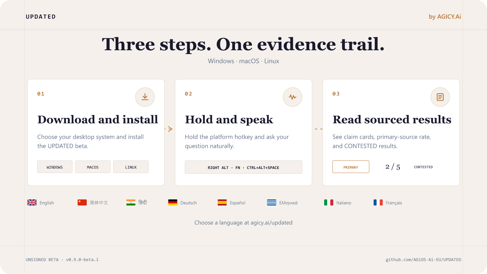

<p align="center">
  
</p>

<p align="center">
  
</p>

<p align="center">
  <a href="LICENSE"></a>
  <a href="https://github.com/AGiOS-Ai-EU/UPDATED/releases"></a>
  
  
</p>

# UPDATED

**Hold a hotkey. Speak a question. Read the sources.**

UPDATED is a voice-first desktop search instrument by AGICY.Ai. It turns a spoken or typed question into certificate-style claim cards with a primary-source rate and an explicit **CONTESTED** state when providers diverge.

## Choose your language

[English](https://agicy.ai/updated?lang=en) ·
[简体中文](https://agicy.ai/updated?lang=zh) ·
[हिन्दी](https://agicy.ai/updated?lang=hi) ·
[Deutsch](https://agicy.ai/updated?lang=de) ·
[Español](https://agicy.ai/updated?lang=es) ·
[Ελληνικά](https://agicy.ai/updated?lang=el) ·
[Italiano](https://agicy.ai/updated?lang=it) ·
[Français](https://agicy.ai/updated?lang=fr)

The live page presents the same three-step guide, installer instructions, and security notice in each language.

## Install the unsigned beta

Download only from the official [UPDATED Releases](https://github.com/AGiOS-Ai-EU/UPDATED/releases) page.

| System | Installer | Default hotkey |
| --- | --- | --- |
| Windows | `UPDATED-0.9.0-beta.1-setup.exe` | Right Alt |
| macOS | `UPDATED-0.9.0-beta.1.dmg` | Fn |
| Linux | `UPDATED-0.9.0-beta.1.AppImage` or `.deb` | Ctrl + Alt + Space |

> [!WARNING]
> This first beta is not code-signed or notarized. Windows SmartScreen and macOS Gatekeeper may warn before opening it. Verify that the download comes from `AGiOS-Ai-EU/UPDATED`.

### Windows

1. Open the downloaded setup file.
2. If SmartScreen appears, choose **More info**, then **Run anyway**.
3. Launch UPDATED and allow microphone access.

### macOS

1. Open the DMG and move UPDATED to Applications.
2. Control-click UPDATED, choose **Open**, then confirm **Open**.
3. Allow Microphone and Accessibility permissions.

### Linux

1. Download the AppImage and mark it executable: `chmod +x UPDATED-*.AppImage`.
2. Open UPDATED. If hold-to-talk requests input access, add your user to the `input` group and sign in again.
3. Allow microphone access.

## How it works

1. **Download and install** the desktop beta.
2. **Hold and speak** using the platform hotkey. Select **Search** as the input mode in Settings.
3. **Read sourced results** in the Search panel: claim cards, primary-source rate, freshness, and CONTESTED provider sections.

The app also retains dictation mode: the same speech pipeline can paste transcription into the focused application instead of running a search.

## Search behavior

| Surface | Behavior |
| --- | --- |
| Dictation mode | Hotkey → microphone → cloud STT → paste or clipboard |
| Search mode | Hotkey → microphone → multi-provider search → sourced claim cards |
| Primary-source rate | Shown as `primary / total`, including `0 / N` |
| CONTESTED | Jaccard similarity below `0.35`; providers remain separated |
| Search history | Last 30 queries stored locally and available to re-run |
| Brave key | Optional; encrypted with Electron `safeStorage` |

Without a Brave Search API key, mock providers demonstrate the CONTESTED interface. Voice transcription currently requires a Freestyle Cloud sign-in and an internet connection.

## Build from source

Requires Node.js 22+, pnpm 10.32.1, and the native compiler toolchain for your operating system.

```powershell
git clone https://github.com/AGiOS-Ai-EU/UPDATED.git
cd UPDATED
pnpm install
pnpm --filter @freestyle-voice/electron run compile:native
pnpm --filter @freestyle-voice/electron run dev
```

Build installers with one of:

```powershell
pnpm --filter @freestyle-voice/electron run build:win
pnpm --filter @freestyle-voice/electron run build:mac
pnpm --filter @freestyle-voice/electron run build:linux
```

## Architecture and status

- [`docs/ARCHITECTURE-MAP.md`](docs/ARCHITECTURE-MAP.md)
- [`docs/SEARCH-ARCHITECTURE.md`](docs/SEARCH-ARCHITECTURE.md)
- [`docs/ROADMAP.md`](docs/ROADMAP.md)
- [`docs/CHANGES.md`](docs/CHANGES.md)

Not yet wired: modifier-plus-hotkey mode switching, a third live search provider, in-app divergence-log viewer, LLM claim extraction, single-window merge, and search-result export.

## License and credits

[MIT](LICENSE). UPDATED is a fork of [freestyle-voice/freestyle](https://github.com/freestyle-voice/freestyle). Upstream `@freestyle-voice/*` package names and Freestyle Cloud references remain where required for compatibility; the distributed desktop product is **UPDATED**.
