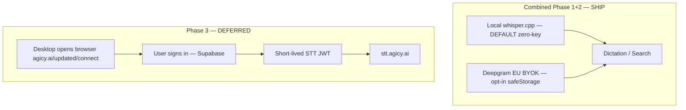

# UPDATED STT Migration Plan — Off Freestyle Cloud

**Document ID:** UPDATED-STT-MIGRATION-001  
**Status:** **Decisions 1–3 APPROVED (2026-08-24).** Combined Phase 1+2 release: **local whisper = zero-key default**; **Deepgram EU BYOK = opt-in**; **Phase 3 deferred**.  
**Date:** 2026-08-24 (updated)  
**Repos:** `UPDATED-international-launch` (desktop); `agicy-platform` only if/when Phase 3 resumes  
**Sources:** STT research (agent fd127cfd), auth audit (agent 8cfdce5a), product decisions (this revision)

---

## Executive summary

**Goal:** First successful dictation with **zero accounts, zero API keys, zero cards** — then optional cloud accuracy via Deepgram EU BYOK. Remove Freestyle Cloud as a gate.

### Approved release shape (ONE ship)

| Slice | STT | Auth / keys | Role in release |
|-------|-----|-------------|-----------------|
| **Local whisper.cpp** | On-device | **None** | **Default** — first-use path |
| **Deepgram EU BYOK** | `api.eu.deepgram.com` | User API key in Electron `safeStorage` only | **Opt-in upgrade** — never alone as first ship |
| **Phase 3 gateway** | `stt.agicy.ai` (future) | Optional AGICY account | **Deferred** — do not block this release |

**Do not** ship BYOK-only. **Do not** gate first dictation on cloud keys, Freestyle sign-in, or AGICY hosted STT.

### Timeline (one number)

| Measure | Target |
|---------|--------|
| **Calendar** | **~6–8 weeks** from 2026-08-24 → ship window **~mid-October 2026** |
| **Eng effort** | ≈ **4–6 eng-weeks** (1–2 engineers) for restore + packaging + Win/macOS/Linux QA |

Deepgram public list price often cited as **~$0.29/hr streaming** — **verify** against current Deepgram EU **streaming vs batch** SKUs before marketing cost claims (batch is typically cheaper per hour of audio).

**LLM cleanup (Decision 2):** Search always **off**. Dictation **on only when a cleanup LLM provider is configured** (BYOK / leftover legacy Freestyle session / Copperway later). Zero-key local STT path has **no cleanup LLM** — raw transcript; Settings copy must say cleanup “requires a cleanup provider.”

**Auth:** Combined release needs **no AGICY account** for voice. Phase 3 (deferred) would add desktop token-exchange on `agicy-platform` later.

**Local STT transport (v1):** **Batch** whisper.cpp (WAV → `/inference`). Accept end-of-utterance latency; show clear **“Transcribing…”** state. Chunked / pseudo-streaming partials = **follow-up**, not this ship.

---

## 1. Current state — pin shipping vs this PR

> **Pin date:** 2026-08-24. Sources: GitHub release [`v0.9.0-beta.3`](https://github.com/AGiOS-Ai-EU/UPDATED/releases/tag/v0.9.0-beta.3), `origin/main` README, `applyAgicySttDefaults` / `AgicyHostedTranscriptionProvider`.

### 1.0 What installers in the wild do **NOW** (`v0.9.0-beta.3` / `main`)

| Fact | Detail |
|------|--------|
| **Default voice** | **AGICY hosted STT** — requires AGICY device sign-in + metered credits |
| **Audio path** | Mic → UPDATED → `https://agicy.ai/api/stt/transcribe` → **Deepgram EU** (AGICY as controller; Deepgram sub-processor) → transcript |
| **On-device whisper** | **Not available** in beta.3 installers (removed in schema v23; restore is this PR) |
| **Freestyle Cloud** | **Not** the default mic path in beta.3+ (README: do not treat `freestylevoice.com` as where mic goes) |
| **Primary migration cohort** | **AGICY-signed-in beta.3** users (release notes: “Sign in with your AGICY account for hosted voice transcription”) |

```
Hotkey → Electron renderer (dictation.ts / streamer.ts)
      → embedded Hono server
      → AgicyHostedTranscriptionProvider
      → POST https://agicy.ai/api/stt/transcribe  (AGICY session)
      → Deepgram EU → transcript
```

### 1.0b What **PR #11** (`feat/local-whisper-stt`) changes **after merge**

| Before (beta.3) | After (combined Phase 1+2) |
|-----------------|----------------------------|
| AGICY account required for first dictation | **Local whisper.cpp = zero-key default** |
| Hosted Deepgram EU via AGICY | Hosted path **deferred / non-default**; optional later |
| No on-device model download | Binary + model download (progress, resume, disk/checksum guards) |
| — | **Deepgram EU BYOK** opt-in via Electron `safeStorage` |

Until #11 merges and a new release ships, **QA / migration tests must assume beta.3 = AGICY-hosted**, not local-whisper.

### 1.1 Legacy Freestyle Cloud path (pre–beta.3 / non-default)

Earlier fork history and still-present code (`FreestyleCloudTranscriptionProvider`) used:

```
Hotkey → WSS localhost → FreestyleCloudTranscriptionProvider
      → wss://service.freestylevoice.com/v2/stream
      → Soniox ASR + Groq cleanup (Freestyle Cloud DO)
```

- **Not** what `v0.9.0-beta.3` installers advertise or default to  
- May still exist in SQLite for users who upgraded from Freestyle-branded beta.1/beta.2 — see §7 (no silent logout)  
- **Audio egress:** any cloud STT path sends mic audio off-device (README / PRIVACY)

### 1.2 Freestyle auth (legacy coupling — not beta.3 default voice)

| Item | Value |
|------|--------|
| OAuth client ID | `freestyle-desktop` |
| Device flow | Better Auth `deviceAuthorization` at `{FREESTYLE_CLOUD_URL}/auth` |
| Approval UX | Browser opens `freestylevoice.com/device` (Apple / Google / GitHub) |
| Session storage | SQLite `sessions` table — plaintext bearer + refresh token, 7-day sliding expiry |
| STT credential seam | `getApiKeyForProvider("freestyle-cloud")` → `getSessionToken()` |
| Gate | `panel.tsx` `SignInGate` — entire app blocked when `!auth.user` |

**Key files (UPDATED):**

| Area | Path |
|------|------|
| Device OAuth routes | `apps/server/src/routes/auth.ts` |
| Session store | `apps/server/src/lib/sessions.ts` |
| Cloud client | `apps/server/src/lib/freestyle-cloud.ts` |
| Streaming provider | `apps/server/src/lib/streaming/providers/freestyle-cloud.ts` |
| Provider registry | `apps/server/src/lib/streaming/registry.ts` (only `freestyle-cloud`) |
| API key seam | `apps/server/src/lib/streaming-stt.ts` |
| Renderer auth | `apps/electron/src/renderer/src/lib/auth-context.tsx` |
| Spec | `specs/freestyle-cloud-auth.md` |

### 1.3 What breaks without Freestyle sign-in (legacy cohort only — **not** beta.3)

> **Scope:** describes the **pre–beta.3 Freestyle-branded builds** of §1.1/§1.2. It is **not** the behaviour of `v0.9.0-beta.3` installers in the wild (§1.0) and **not** the behaviour after PR #11 (§1.0b).

| Surface (legacy builds) | Without Freestyle session |
|---------|-----------------|
| Panel UI | Hard `SignInGate` — no settings, no companion |
| Dictation / search-voice | `cloud_auth_required` — no STT token |
| LLM cleanup | Legacy default `freestyle-cloud/post-process` — also gated |
| Cloud prefs / billing / org | Freestyle Cloud–coupled (out of STT scope) |

**beta.3 does not behave this way:** beta.3 seeds **`llm_cleanup=false`** (§9.1) and has **no dependency on Freestyle cleanup** — its voice path is AGICY hosted → Deepgram EU (§1.0), and cleanup is simply off. The `freestyle-cloud/post-process` default above applies only to the legacy cohort.

Schema migrations **v22–v23** removed all non–Freestyle Cloud STT providers and dropped `api_keys` table.

---

## 2. Current state — AGICY auth (agicy-platform)

> Full audit completed on `agicy-platform` (Supabase auth, no desktop OAuth).

### 2.1 Stack

| Layer | Technology | Notes |
|-------|------------|-------|
| Identity provider | **Supabase Auth** (`@supabase/ssr`) | Custom domain `https://auth.agicy.ai` |
| **Not used** | Better Auth, NextAuth, Clerk | Better Auth is Freestyle Cloud only |
| User DB (registrations) | **Neon PostgreSQL** | `user_registrations` table — audit log, not primary auth |
| Session transport | Supabase JWT in **HttpOnly cookies** (`sb-*-auth-token`) |
| Middleware | `src/proxy.ts` | Session refresh + route protection |

### 2.2 Sign-in methods (live on `/login`)

| Method | Implementation | Callback |
|--------|----------------|----------|
| **Email + password** | `signInWithPassword`; auto `signUp` if unknown account | Client redirect to `?redirect=` path (no server callback for password) |
| **Google OAuth** | `signInWithOAuth({ provider: "google" })` | `/auth/callback?code=…` → `exchangeCodeForSession` |
| LinkedIn OIDC | `signInWithOAuth({ provider: "linkedin_oidc" })` | Same callback |
| WhatsApp OTP | `signInWithOtp` + `verifyOtp` (phone) | In-page session |
| Dev bypass | `agicy_dev_session` cookie | **Dev only** — stripped in production |

**Google OAuth configuration** (from `.env.example`):

- Supabase Auth → Providers → Google (not raw `GOOGLE_CLIENT_*` in Next.js)
- Authorized redirect URI: `https://auth.agicy.ai/auth/v1/callback`
- Site URL: `https://agicy.ai`
- App callback: `https://agicy.ai/auth/callback?next=/dashboard`

### 2.3 Key auth files (agicy-platform)

| Area | Path |
|------|------|
| Browser client | `src/lib/supabase/client.ts` |
| Server client | `src/lib/supabase/server.ts` |
| OAuth callback | `src/app/auth/callback/route.ts` |
| Sign-out | `src/app/auth/signout/route.ts` |
| Login UI | `src/app/login/LoginClient.tsx` |
| API auth helper | `src/lib/requireAuth.ts` |
| Gateway operator auth | `src/lib/proxyAuth.ts` |
| Session middleware | `src/proxy.ts` |
| Registration audit | `src/lib/userRegistrationsDb.ts`, `src/app/api/auth/record-registration/route.ts` |
| Env reference | `.env.example` (Supabase, admin, vault keys) |

### 2.4 Tokens issued today

| Token | Issuer | Lifetime | Used for |
|-------|--------|----------|----------|
| Supabase access JWT | Supabase (`auth.agicy.ai`) | ~1 h (auto-refresh via cookie) | Dashboard, `/api/*` routes via `requireAuth()` |
| Supabase refresh token | Supabase | Long-lived (cookie) | Silent refresh in browser |
| Playground session cookie | AGICY HMAC (`PLAYGROUND_SESSION_SECRET`) | Configurable TTL | Playground chat/voice only — **separate from Supabase** |
| Gateway workspace API secret | AGICY proxy vault | Persistent | `Authorization: Bearer` on `proxy.agicy.ai` |
| Admin Basic / `ADMIN_API_KEY` | AGICY | Session / static | Admin routes |

### 2.5 Gap: no desktop OAuth flow exists

**Searched:** device code, PKCE native, deep link (`agicy://`, `updated://`), desktop callback routes.

**Result:** `agicy-platform` has **no** desktop OAuth device flow, no custom URL scheme handler, and no STT token issuance API for native clients. The closest precedent is:

- **Playground voice STT** (`/api/playground/speech/stt`) — requires signed playground cookie, uses server-side `GROQ_API_KEY` (not user-facing BYOK)
- **Dashboard playground bind** (`/api/playground/session?bind=1`) — maps Supabase session → playground cookie for web only

Freestyle's Better Auth device flow (`POST /auth/device/code` → poll `/auth/device/token`) **cannot** be pointed at Supabase without new server routes on `agicy-platform`.

---

## 3. Can AGICY auth replace Freestyle device OAuth?

### 3.1 Direct swap — **no**

| Question | Answer |
|----------|--------|
| Can Supabase JWT be sent to `service.freestylevoice.com/v2/stream`? | **No** — Freestyle Cloud validates its own Better Auth sessions only |
| Can Freestyle backend accept AGICY JWT without Freestyle change? | **No** — different issuer, audience, and user store |
| Can desktop reuse web Supabase cookies? | **No** — HttpOnly cookies stay in browser; Electron cannot read them |
| Can desktop store Supabase refresh token in `safeStorage`? | Possible but **not recommended** — broad account scope; prefer scoped STT token |

### 3.2 Integrated model (combined release + deferred gateway)



| Slice | Freestyle OAuth | AGICY account | Credential |
|-------|-----------------|---------------|------------|
| Local whisper (default) | Not required | Not required | None |
| Deepgram EU BYOK | Not required | Not required | User API key in `safeStorage` |
| Phase 3 (deferred) | Not used | Optional | Scoped STT JWT |

---

## 4. Phase detail

### Combined Phase 1+2 — Local default + Deepgram EU BYOK opt-in (SHIP THIS)

**STT default:** Restore whisper-local provider + model download UX. First dictation works offline with **0 keys**.

**STT opt-in:** Deepgram EU BYOK via keychain (mirror Brave search pattern). Settings → Dictation provider picker.

**Auth:** None for voice. No Freestyle / AGICY gate on first dictation.

> **Auth audit (8cfdce5a):** Combined release requires **no `agicy-platform` changes**. All work stays in this repo until Phase 3 resumes.

- `apps/electron/src/main/stt-keychain.ts` — Deepgram key only (opt-in)
- IPC: `stt:set-key`, `stt:clear-key`, `stt:key-status`
- Server receives BYOK key per-request via main IPC — **never** in SQLite
- Local whisper: no key; binary + model under userData

**UI / routing:**

- Settings → Dictation: **Local (on-device)** selected by default; **Deepgram EU (BYOK)** optional
- Remove mandatory `SignInGate` for dictation/search voice
- **LLM cleanup:** search always **off**; dictation **on only if** `llm_cleanup=true` **and** a cleanup LLM is configured (otherwise raw transcript — zero-key path has no cleanup model)
- Stop forcing Freestyle / AGICY hosted as voice default on login (sessions may remain)
- **Local transport:** batch inference; UI shows **Transcribing…** (not fake partials)

**Files (UPDATED core):**

| Area | Files |
|------|-------|
| Providers | `streaming/registry.ts`, `streaming-stt.ts`, `providers/whisper-local.ts`, `providers/deepgram.ts` |
| Whisper runtime | `lib/whisper/*` (binary ensure, model download, server) |
| Routes | `routes/stream.ts`, `routes/transcribe.ts` |
| Keychain | `electron/src/main/stt-keychain.ts`, preload + main IPC |
| Auth gate | `panel.tsx`, `auth-context.tsx`, `onboarding-core.ts` |
| Schema | `schema.ts` v27+ — seed local-whisper default; preserve existing sessions |
| Docs | `README.md`, `NOTICE`, `VOICE-DATA-FLOW.md`, this plan |

**Packaging:** ~5–15 MB binary per platform; models on first use. Default `base-q5_1` is **~57 MB** (59,707,625 bytes measured on disk) — the earlier “~145 MB” figure conflated it with the non-quantized legacy `ggml-base.bin` (142 MB).

**Effort:** included in the **6–8 calendar week** combined target above.

### Phase 3 — AGICY-hosted EU gateway (**DEFERRED**)

Do not start until after the combined local+BYOK release ships.

**STT (future):** Deploy gateway (Deepgram EU or Speechmatics on Copperway) at `stt.agicy.ai`.

**Auth (future work on agicy-platform):** device code → scoped STT JWT (`scope: "stt:stream"`, short TTL). Do **not** pass full Supabase JWTs into the desktop STT path.

**Effort (when resumed):** +6–10 eng-weeks (gateway infra + both repos).

---

## 5. Option matrix (STT)

| Criterion | **Local Whisper (default)** | Deepgram EU BYOK | AGICY gateway (deferred) |
|-----------|----------------------------|------------------|--------------------------|
| Removes Freestyle sign-in | ✅ | ✅ | ✅ |
| **Installs → first successful dictation** | ⭐ **Best** (0 keys) | ❌ needs key before voice | ❌ needs account / infra |
| Time to ship (combined) | **In 6–8 cal wk release** | Same release (opt-in) | Later |
| EU privacy | ⭐⭐⭐⭐⭐ | ⭐⭐⭐ (EU endpoint) | ⭐⭐⭐⭐ if hosted EU |
| Offline | ✅ | ❌ | ❌ |
| AGICY account required | ❌ | ❌ | Optional |
| Streaming partials | ❌ Batch for v1 (Transcribing…) | ✅ Deepgram (later) | ✅ |
| Ops burden | Low | None (user key) | High |
| Onboarding + privacy thesis | ⭐ Wins both | Accuracy upgrade | Convenience later |

---

## 6. Cost / privacy comparison

| Path | Cost (indicative) | Audio leaves device? | EU-friendly | Sign-in |
|------|-------------------|----------------------|-------------|---------|
| **Local whisper (default)** | Electricity | ❌ | ⭐ Best | ❌ |
| Deepgram EU BYOK (opt-in) | ~$0.29/hr **streaming** — **verify vs batch** | ✅ To EU endpoint | ✅ Strong | ❌ API key only |
| Freestyle Cloud (legacy) | Free tier + Pro | ✅ Always | ❌ US service | ✅ freestylevoice.com |
| AGICY gateway (deferred) | AGICY absorbs or freemium | ✅ To AGICY EU | ✅ If hosted EU | Optional AGICY account |

*Assumes ~5 min dictation/day ≈ 2.5 hr/month. Confirm Deepgram EU list prices before quoting in marketing.*

**Counsel note (BYOK roles — future path only):** With user-supplied Deepgram keys, the **user (or their org) is more likely the controller** for that audio processing, and **Deepgram their processor** — a lighter AGICY subprocessor footprint than hosted STT (where AGICY is controller and Deepgram AGICY’s sub-processor). **Confirm with counsel**; treat as argument for BYOK-as-opt-in, not as legal advice. **This does not describe today's shipping product:** on the live beta.3 hosted path (§1.0) **AGICY is the controller** — see §11.

**Lawyer-track (parallel, does not block eng — but already overdue):** the Art. 28 Deepgram DPA is **not** a future gate. It attached when beta.3 shipped audio to Deepgram EU under AGICY as controller (§1.0), so it is **remediation on a live clock** (§11), alongside obtaining Deepgram's **audio retention** answer in writing. Counsel work runs **in parallel** with whisper runtime work: eng must keep shipping local-default + BYOK opt-in UX, because the combined release **reduces** exposure by keeping most audio on-device.

---

## 7. Migration for existing beta users

**Which cohorts exist in the wild today?**

| Cohort | Exists now? | How they got there |
|--------|-------------|-------------------|
| **AGICY-signed-in `v0.9.0-beta.3`** | **Yes — primary shipping cohort** | GitHub / agicy.ai installers; hosted Deepgram EU voice (§1.0) |
| Freestyle-signed-in (beta.1/beta.2 era) | Possible leftover upgrades | Older installers / Freestyle device OAuth still in SQLite |
| Fresh install after **PR #11 release** | Not yet (until merge + cut) | Will get local-whisper default |

| Cohort | Behavior on upgrade **to the combined local-whisper release** |
|--------|---------------------|
| **AGICY-signed-in beta.3 (hosted STT)** — primary | **No silent logout.** Keep AGICY device session for account/billing; **do not** keep hosted STT as voice default. Flip default voice to **local-whisper**; hosted/gateway stays deferred/opt-in later. |
| Freestyle-signed-in (legacy) | **No silent logout.** Keep Freestyle session in SQLite; stop using it as default voice. Offer Local default + optional Deepgram BYOK. Legacy Freestyle path may remain behind flag until hard-remove. |
| **Brave Search key already saved** (`search-keychain.ts` / Electron `safeStorage`) | **Preserve the Brave key.** Schema / STT migrations must **not** clear search keychain entries. Silent fall-back to mock while a valid Brave key remains stored is a **bug**. Live search must keep working after upgrade without re-paste. |
| Fresh install (post–#11 release) | Local whisper default; **0 keys** for voice; cleanup **off** until a cleanup provider is configured; search cleanup always off. |

Schema / keychain invariant: voice default flip and whisper restore must touch **STT / model_configs / voice settings only** — never wipe `search-keychain` or Brave `safeStorage` slots.

---

## 7b. Deprecation list (Freestyle Cloud)

| Item | When |
|------|------|
| Mandatory `SignInGate` for voice | Combined release |
| Device OAuth **required** for STT | Combined release |
| `applyFreestyleCloudDefaults()` / `applyAgicySttDefaults()` forcing cloud voice | Combined release |
| Cloud as default voice model | Combined release |
| `freestylevoice.com/device` as onboarding for voice | Combined release |
| `freestyle-cloud.ts` provider binary | Later hard-remove or flag |
| README claiming Freestyle / AGICY hosted as default mic path | Combined release |

---

## 8. Decisions — APPROVED

### Decision 1 — Default STT — **modified A (APPROVED)**

Ship Phase 1+2 as **one release**. **Local whisper = zero-key default.** **Deepgram EU BYOK = opt-in upgrade.** Do **not** ship BYOK alone; do **not** gate first dictation on cloud keys or Freestyle.

### Decision 2 — LLM cleanup — **split + provider-gated (APPROVED)**

| Mode | Cleanup |
|------|---------|
| **Search** | Always **off** (raw query text) |
| **Dictation** | **On only when** a cleanup LLM provider is configured (BYOK / leftover legacy Freestyle session / future Copperway). Otherwise **off** — raw local transcript. |

**Zero-key honesty:** Combined release does **not** ship a packaged local cleanup LLM. Do not invent one in estimates or UI. Settings copy for the cleanup toggle: **“Requires a cleanup provider.”** Prefer leaving `llm_cleanup` default **false** on fresh installs until the user configures an LLM.

### Decision 2b — Local STT transport — **batch for v1 (APPROVED)**

Freestyle Cloud streamed partials; local whisper.cpp default is **batch** (record → WAV → whisper-server `/inference` → paste).

| Choice | Status |
|--------|--------|
| **Accept batch latency** for first local ship | **Chosen** |
| Clear **“Transcribing…”** (or equivalent) after hotkey release | **Required** — not an indefinite spinner |
| Cold-start note | First utterance may include model load; if hotkey→text is **≥ ~10s**, show an explicit warming / loading state, not a silent hang |
| Chunked / pseudo-streaming partials | **Follow-up** — not blocking combined Phase 1+2 |

QA must not treat missing live partials as a local-STT regression.

### Decision 3 — Phase 3 gateway — **defer (APPROVED)**

Post combined release. Revisit when Copperway / `stt.agicy.ai` infra is ready.

---

## 9. API keys & Copperway

Key strategy across phases. **Search mode does not call an LLM today** — citation cards format Brave/mock results only; no claim extraction.

### 9.1 Today — `v0.9.0-beta.3` in the wild (AGICY hosted)

| Capability | Required? | Key / credential | Notes |
|------------|-----------|------------------|-------|
| **STT** | **Yes** | **AGICY device session** | Hosted path → Deepgram EU via `agicy.ai/api/stt/transcribe` (metered credits). **Not** Freestyle Cloud default. |
| LLM cleanup | Off by default | — | beta.3 seeds `llm_cleanup=false` |
| Search | No | Brave Search API key (optional) | Mock providers without key; CONTESTED UI still works |
| LLM (search) | No | — | Not used in search path |
| TTS | No | — | Not in UPDATED beta |
| Local whisper | ❌ | — | Not in beta.3 installers — arrives with PR #11 release |

### 9.2 After combined Phase 1+2 (local default + BYOK opt-in)

| Capability | Required? | Provider / key | Notes |
|------------|-----------|----------------|-------|
| **STT (default)** | **Yes** for voice | **Local whisper** — **0 keys** | First successful dictation |
| **STT (opt-in)** | No | **Deepgram EU** BYOK in `safeStorage` | Accuracy upgrade (batch or stream later) |
| Search | No | Brave key (optional) | Mock without key; **preserve existing Brave keys on upgrade** |
| **LLM cleanup** | No for zero-key | Only if user configures an LLM | Search always off; dictation gated on provider |

**Minimal install:** **0 keys** for default voice (local whisper). Optional Brave for live search; optional Deepgram for cloud STT; optional cleanup LLM.

### 9.3 Copperway role (pointer — Phase 3 deferred)

Copperway (`proxy.agicy.ai`) is AGICY’s **LLM-only** OpenAI-compatible gateway. It does **not** proxy STT in Phase 1–2.

- **STT:** local whisper (default) or Deepgram EU BYOK direct — **never** Copperway.
- **Cleanup LLM via Copperway:** optional later when a user has a workspace secret; not part of zero-key first dictation.
- Full credential-layer detail for gateway engineers: see agicy-platform gateway docs / dashboard API keys. **Do not** block this combined release on Copperway work — **Phase 3 deferred**.

### 9.4 Phase 3 — AGICY account (deferred — do not scan as current default)

When resumed (post combined release): optional AGICY sign-in → scoped STT JWT → `stt.agicy.ai`. Optional Brave for search. **Not** the first-use path today.

### 9.5 Summary matrix (APPROVED — eng scan this)

| Capability | Required for first dictation? | Default / options | Keys |
|------------|------------------------------|-------------------|------|
| **Voice STT** | **Yes** | **Local whisper (default)**; Deepgram EU BYOK opt-in; Phase 3 gateway **deferred** | **0 keys** on local default; Deepgram key only if opted in |
| Search | No | Mock without key; Brave optional | Brave BYOK optional — **preserve on upgrade** |
| LLM cleanup | No | Off until cleanup provider configured; search always off | Cleanup LLM BYOK / Freestyle / Copperway later — optional |
| Voice TTS | No | — | — |

**Default key strategy:** **0 keys for default voice (local whisper).** Deepgram EU BYOK = optional accuracy upgrade. Phase 3 hosted STT = deferred. Search works with 0 keys on mock.

### 9.6 Copperway deep-dive — deferred

Skip for combined Phase 1+2 eng. Copperway cannot carry STT today; gateway credential layers and playground Groq STT are **web/gateway concerns**, not UPDATED desktop first-dictation. Revisit when Phase 3 resumes — see agicy-platform gateway docs.

### 9.7 Setup scenarios (UPDATED desktop)

| Profile | Keys / accounts | Voice search | Live web search |
|---------|-----------------|--------------|-----------------|
| **Minimal (default)** | **0 keys** — local whisper | ✅ offline | Mock citations only |
| **Minimal + live search** | Local + Brave | ✅ | ✅ |
| **Cloud STT upgrade** | Local + Deepgram EU BYOK (+ optional Brave) | ✅ cloud when selected | Optional |
| **Power user** | Deepgram BYOK + Brave + optional cleanup LLM / Copperway | ✅ | ✅ |
| **AGICY-hosted (Phase 3 — deferred)** | AGICY account (STT JWT) + optional Brave | ✅ | Optional |

**NOW (`v0.9.0-beta.3` installers / `main`):** default voice = **AGICY hosted Deepgram EU** (sign-in + credits). Freestyle is not the advertised mic path.  
**AFTER PR #11 merges + release:** default voice = **local whisper (0 keys)**; Deepgram EU **BYOK** opt-in; no Freestyle / AGICY gate for first dictation.

---

## 10. Open questions (non-blocking)

1. Freestyle Cloud hard remove vs optional legacy provider flag  
2. 8-language QA acceptance criteria per marketing language  
3. Mobile keyboard (`apps/mobile/`) — same local/BYOK model later?  
4. Deep link protocol name: `agicy-updated://` vs HTTPS loopback  
5. ~~Telemetry: confirm PostHog events never include audio/transcript~~ — **resolved**, moved to §11 (audit 9d90ad5a: no voice content leaves via PostHog; separate PostHog transfer/consent issues on the `fix/telemetry-privacy` PR)  
6. Confirm Deepgram EU **streaming vs batch** list prices before cost copy — **batch this with the §11 audio-retention ask**; same vendor conversation, one email  

---

## 11. Approval & blocking checklist

### Decisions (done)

- [x] **Decision 1** — Local default + Deepgram BYOK opt-in; combined Phase 1+2 (§8)
- [x] **Decision 2** — Cleanup provider-gated: off in search; on in dictation only with cleanup LLM; zero-key = raw (§8)
- [x] **Decision 2b** — Local batch STT for v1; Transcribing… UI; pseudo-streaming follow-up (§8)
- [x] **Decision 3** — Phase 3 deferred (§8)

### ⚠️ Already due — remediation in progress (**not** a future gate)

> **The Art. 28 obligation attached the day `v0.9.0-beta.3` shipped**, not at the combined release. Per §1.0, beta.3 installers **already** route mic audio app → `https://agicy.ai/api/stt/transcribe` → **Deepgram EU**, with **AGICY as controller and Deepgram as sub-processor**. That is live production processing of personal data (voice) by a sub-processor **today**. Treat the items below as **overdue remediation on a real-world clock**, not as pre-release checkboxes.

| Clock | Value |
|-------|-------|
| Obligation attached | **2026-08-23 20:40:32 UTC** — `v0.9.0-beta.3` pre-release published (`gh release list --repo AGiOS-Ai-EU/UPDATED`) |
| Exposure window | 2026-08-23 20:40 UTC → **present, still open** |
| Elapsed | **Hours/days, not weeks** — this is why it is remediable rather than a standing breach |
| Status | **Remediation in progress** |

The short window is the good news and the reason to move now: the sooner the DPA is executed and PR #11 ships, the smaller the period in which AGICY was a controller sending EU voice to a sub-processor without Art. 28 cover.

- [ ] **Art. 28 DPA with Deepgram — OVERDUE, execute now.** AGICY = controller, Deepgram = sub-processor for the **live hosted beta.3 path**. Not conditional on BYOK or on the combined release. Also covers any cleanup LLM processors.
- [ ] **Deepgram audio retention answer — obtain in writing.** How long is submitted audio held server-side (and is zero-retention / no-model-training available on the EU endpoint)? **Required now** if beta.3 has EU users — feeds Art. 30 records, the retention table in `PRIVACY.md`, and any breach/erasure response. Ask the non-blocking **EU streaming vs batch pricing** question (§10.6) in the same email — one vendor conversation.
- [ ] **Sub-processor disclosure** — list Deepgram EU on `agicy.ai` + `NOTICE` / README as a **current** sub-processor for hosted STT, not a future one.
- [ ] **`PRIVACY.md` discloses the live hosted path** — hosted beta.3 flow described as primary/current; BYOK as forthcoming/optional. (Done — keep in sync.)
- [ ] **Art. 30 record of processing** — must include the hosted beta.3 STT activity that is running today.
- [x] **Telemetry is not a second voice-processing activity** — static audit (agent 9d90ad5a) confirms **no** transcript, audio, search query, LLM input/output, window title, URL, clipboard, evidence or divergence content leaves via PostHog. The hosted STT path above is the only voice egress. **Adjacent PostHog issues (US transfer, default-on, opt-out) are real but separate** and tracked on the `fix/telemetry-privacy` PR — do not edit telemetry code from this branch.

**Counter-framing for counsel (useful, and true):** the combined local-default release **reduces** exposure rather than creating it — after PR #11 ships, most users' audio **stops leaving the device** entirely, and the remaining cloud path is user-keyed BYOK. Shipping #11 is **mitigation**, so DPA remediation must **not** be used as a reason to delay it. Conversely, shipping #11 does **not** retroactively cure the beta.3 period; the DPA still has to be executed and the exposure window documented.

**Counsel note (BYOK roles — do not over-read):** with user-supplied Deepgram keys the **user** may be the controller and Deepgram **their** processor (lighter Art. 28 footprint) — see §6. This framing applies **only to the future BYOK path**. It does **not** apply to today's hosted beta.3 path, where **AGICY is the controller** and the Art. 28 duty is AGICY's alone.

### Blocking before public combined release

- [ ] Legal review — `NOTICE` + README third-party rows match local-default + BYOK-opt-in
- [ ] Security review — `safeStorage` Deepgram key handling
- [ ] **E2E acceptance (hold release against):**
  1. **Fresh profile, no cached model** (empty `~/.cache/updated/whisper-*` or equivalent)
  2. Model download completes with **visible progress**; interrupt mid-download → **resume** continues (not restart-from-zero only)
  3. **Network off after download** → hold hotkey → text still appears (**offline claim**)
  4. Simulate **download failure** → UI offers **Deepgram EU BYOK**, not a dead-end
  5. Note **cold-start hotkey→text latency**; if **≥ ~10s**, show warming / loading state (not a silent spinner)
  6. Batch local path: after release, UI shows **Transcribing…** (no expectation of Freestyle-style live partials)
  7. **Brave key preserved** — upgrade with an existing Brave key still uses live search (no silent mock)
  8. Cross-check Win / macOS / Linux for (1)–(3)
  9. **Insufficient disk** → clear error that names **space required** (model + buffer); **no** `.downloading` / corrupt `.bin` left for next launch
  10. **Checksum** after download + verify before first model load; corrupt/truncated file → explicit `whisper_checksum_failed` / `whisper_model_corrupt` (never ambiguous “not ready”)
- [ ] Beta migration: Freestyle / AGICY sessions preserved (no silent logout); Brave keychain preserved

#### E2E smoke status (updated 2026-08-24)

Automated coverage lives in `apps/server/tests/`:

| Suite | Runs in CI? | Covers |
|-------|-------------|--------|
| `whisper-download-resume.test.ts` | Yes | Stubbed Range-capable origin: monotonic progress, interrupt → `bytes=<partial>-` resume, byte-identical stitched file, checksum mismatch leaves no artifacts |
| `whisper-model-integrity.test.ts` | Yes | Sidecar write on legacy caches, `whisper_model_corrupt` on mismatch, artifact cleanup |
| `whisper-local-e2e.test.ts` | **No** — opt-in via `WHISPER_E2E=1` | Real 57 MB Hugging Face download, real interrupt/resume, real whisper-server, real transcript |

| # | Criterion | win32 x64 | macOS / Linux |
|---|-----------|-----------|---------------|
| 1 | Fresh profile, no cached model | ✅ | ⬜ |
| 2 | Visible progress; interrupt at 60% → **resume** (not restart) | ✅ resumed from 35,553,792 / 59,707,625 B via HTTP Range | ⬜ |
| 3 | Offline dictation after download | ✅ all non-loopback fetch blocked; transcript still returned | ⬜ |
| 4 | Download failure → offers Deepgram EU BYOK | ⬜ manual UI check | ⬜ |
| 5 | Cold-start hotkey→text latency | ✅ **1.8 s** cold / 1.1 s warm — well under the ~10 s warming threshold | ⬜ |
| 6 | Batch path shows **Transcribing…** | ⬜ manual UI check | ⬜ |
| 7 | Brave key preserved on upgrade | ⬜ manual upgrade check | ⬜ |
| 9 | Insufficient disk → named space, no corrupt leftover | ✅ unit-level (`disk.test.ts`, wipe-on-ENOSPC) | ⬜ |
| 10 | Checksum after download + before load | ✅ unit + E2E (`.sha256` sidecar) | ⬜ |

Remaining before release: items 4, 6, 7 (Electron UI, not server-testable) and cross-platform runs of 1–3, 5.

### Non-blocking / later

- [ ] Phase 3 STT JWT scope (when gateway resumes)
- [ ] Divergence-log Save As export (ROADMAP P1 day-of-work)

---

## Appendix A — Auth audit summary (agicy-platform)

| Check | Status |
|-------|--------|
| Supabase configured | ✅ `auth.agicy.ai`, `@supabase/ssr` |
| Google OAuth | ✅ Supabase provider; callback `/auth/callback` |
| Email login | ✅ Password sign-in + auto sign-up; email confirmation for new accounts |
| Session handling | ✅ HttpOnly cookies; `proxy.ts` refresh; `requireAuth()` on API routes |
| Desktop OAuth | ❌ **Not implemented** — must be built for Phase 3 |
| STT token API | ❌ **Not implemented** — must be built for Phase 3 |
| Freestyle JWT swap | ❌ **Not possible** without Freestyle backend change |
| Phase 1 platform scope | ✅ **No `agicy-platform` changes** — BYOK in Electron only |

## Appendix B — STT research summary (fd127cfd)

| Finding | Detail |
|---------|--------|
| **beta.3 / main path (NOW)** | AGICY hosted → Deepgram EU (`agicy.ai/api/stt/transcribe`) |
| Legacy Freestyle path | Streaming WSS → Freestyle Cloud → Soniox + Groq (code still present; not beta.3 default) |
| v23 migration | Dropped `api_keys`, all non–freestyle-cloud providers (local restore = PR #11) |
| Upstream | Cloud-oriented; local restore from pre-removal + this PR |
| Recommended | Combined Phase 1+2: local whisper default + Deepgram EU BYOK opt-in; Phase 3 deferred |
| Key precedent | `search-keychain.ts` for BYOK; `specs/transcription-audit.md` for provider port |

---

*Research and specification only. No STT implementation in this document.*
