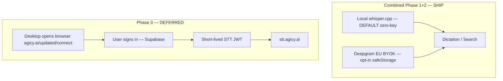

# UPDATED STT Migration Plan — Off Freestyle Cloud

**Document ID:** UPDATED-STT-MIGRATION-001  
**Status:** **Decisions 1–3 APPROVED (2026-08-24).** Combined Phase 1+2 release: **local whisper = zero-key default**; **Deepgram EU BYOK = opt-in**; **Phase 3 deferred**.  
**Date:** 2026-08-24 (updated)  
**Repos:** `UPDATED-international-launch` (desktop); `agicy-platform` only if/when Phase 3 resumes  
**Sources:** STT research (agent fd127cfd), auth audit (agent 8cfdce5a), product decisions (this revision)

---

## Executive summary

**Goal:** First successful dictation with **zero accounts, zero API keys, zero cards** — then optional cloud accuracy via Deepgram EU BYOK. Remove Freestyle Cloud as a gate.

### Approved release shape (ONE ship)

| Slice | STT | Auth / keys | Role in release |
|-------|-----|-------------|-----------------|
| **Local whisper.cpp** | On-device | **None** | **Default** — first-use path |
| **Deepgram EU BYOK** | `api.eu.deepgram.com` | User API key in Electron `safeStorage` only | **Opt-in upgrade** — never alone as first ship |
| **Phase 3 gateway** | `stt.agicy.ai` (future) | Optional AGICY account | **Deferred** — do not block this release |

**Do not** ship BYOK-only. **Do not** gate first dictation on cloud keys, Freestyle sign-in, or AGICY hosted STT.

### Timeline (one number)

| Measure | Target |
|---------|--------|
| **Calendar** | **~6–8 weeks** from 2026-08-24 → ship window **~mid-October 2026** |
| **Eng effort** | ≈ **4–6 eng-weeks** (1–2 engineers) for restore + packaging + Win/macOS/Linux QA |

Deepgram public list price often cited as **~$0.29/hr streaming** — **verify** against current Deepgram EU **streaming vs batch** SKUs before marketing cost claims (batch is typically cheaper per hour of audio).

**LLM cleanup (Decision 2):** **on in dictation**, **off in search** (routing — search needs raw query text).

**Auth:** Combined release needs **no AGICY account** for voice. Phase 3 (deferred) would add desktop token-exchange on `agicy-platform` later.

---

## 1. Current state — Freestyle Cloud coupling (UPDATED)

### 1.1 STT data path

```
Hotkey → Electron renderer (dictation.ts / streamer.ts)
      → WSS localhost:4649/stream
      → embedded Hono server (stream.ts)
      → FreestyleCloudTranscriptionProvider
      → wss://service.freestylevoice.com/v2/stream  (Bearer session token)
      → Soniox ASR + Groq cleanup (in Freestyle Cloud DO)
```

- **Primary transport:** streaming 16 kHz mono PCM over WebSocket  
- **Fallback:** WAV batch → `POST /api/transcribe` → Freestyle Cloud `/v2/transcribe`  
- **Audio egress:** all cloud STT sends microphone audio off-device (README disclosure)

### 1.2 Freestyle auth (what STT depends on today)

| Item | Value |
|------|--------|
| OAuth client ID | `freestyle-desktop` |
| Device flow | Better Auth `deviceAuthorization` at `{FREESTYLE_CLOUD_URL}/auth` |
| Approval UX | Browser opens `freestylevoice.com/device` (Apple / Google / GitHub) |
| Session storage | SQLite `sessions` table — plaintext bearer + refresh token, 7-day sliding expiry |
| STT credential seam | `getApiKeyForProvider("freestyle-cloud")` → `getSessionToken()` |
| Gate | `panel.tsx` `SignInGate` — entire app blocked when `!auth.user` |

**Key files (UPDATED):**

| Area | Path |
|------|------|
| Device OAuth routes | `apps/server/src/routes/auth.ts` |
| Session store | `apps/server/src/lib/sessions.ts` |
| Cloud client | `apps/server/src/lib/freestyle-cloud.ts` |
| Streaming provider | `apps/server/src/lib/streaming/providers/freestyle-cloud.ts` |
| Provider registry | `apps/server/src/lib/streaming/registry.ts` (only `freestyle-cloud`) |
| API key seam | `apps/server/src/lib/streaming-stt.ts` |
| Renderer auth | `apps/electron/src/renderer/src/lib/auth-context.tsx` |
| Spec | `specs/freestyle-cloud-auth.md` |

### 1.3 What breaks without Freestyle sign-in

| Surface | Without session |
|---------|-----------------|
| Panel UI | Hard `SignInGate` — no settings, no companion |
| Dictation / search-voice | `cloud_auth_required` — no STT token |
| LLM cleanup | Default `freestyle-cloud/post-process` — also gated |
| Cloud prefs / billing / org | Freestyle Cloud–coupled (out of STT scope) |

Schema migrations **v22–v23** removed all non–Freestyle Cloud STT providers and dropped `api_keys` table.

---

## 2. Current state — AGICY auth (agicy-platform)

> Full audit completed on `agicy-platform` (Supabase auth, no desktop OAuth).

### 2.1 Stack

| Layer | Technology | Notes |
|-------|------------|-------|
| Identity provider | **Supabase Auth** (`@supabase/ssr`) | Custom domain `https://auth.agicy.ai` |
| **Not used** | Better Auth, NextAuth, Clerk | Better Auth is Freestyle Cloud only |
| User DB (registrations) | **Neon PostgreSQL** | `user_registrations` table — audit log, not primary auth |
| Session transport | Supabase JWT in **HttpOnly cookies** (`sb-*-auth-token`) |
| Middleware | `src/proxy.ts` | Session refresh + route protection |

### 2.2 Sign-in methods (live on `/login`)

| Method | Implementation | Callback |
|--------|----------------|----------|
| **Email + password** | `signInWithPassword`; auto `signUp` if unknown account | Client redirect to `?redirect=` path (no server callback for password) |
| **Google OAuth** | `signInWithOAuth({ provider: "google" })` | `/auth/callback?code=…` → `exchangeCodeForSession` |
| LinkedIn OIDC | `signInWithOAuth({ provider: "linkedin_oidc" })` | Same callback |
| WhatsApp OTP | `signInWithOtp` + `verifyOtp` (phone) | In-page session |
| Dev bypass | `agicy_dev_session` cookie | **Dev only** — stripped in production |

**Google OAuth configuration** (from `.env.example`):

- Supabase Auth → Providers → Google (not raw `GOOGLE_CLIENT_*` in Next.js)
- Authorized redirect URI: `https://auth.agicy.ai/auth/v1/callback`
- Site URL: `https://agicy.ai`
- App callback: `https://agicy.ai/auth/callback?next=/dashboard`

### 2.3 Key auth files (agicy-platform)

| Area | Path |
|------|------|
| Browser client | `src/lib/supabase/client.ts` |
| Server client | `src/lib/supabase/server.ts` |
| OAuth callback | `src/app/auth/callback/route.ts` |
| Sign-out | `src/app/auth/signout/route.ts` |
| Login UI | `src/app/login/LoginClient.tsx` |
| API auth helper | `src/lib/requireAuth.ts` |
| Gateway operator auth | `src/lib/proxyAuth.ts` |
| Session middleware | `src/proxy.ts` |
| Registration audit | `src/lib/userRegistrationsDb.ts`, `src/app/api/auth/record-registration/route.ts` |
| Env reference | `.env.example` (Supabase, admin, vault keys) |

### 2.4 Tokens issued today

| Token | Issuer | Lifetime | Used for |
|-------|--------|----------|----------|
| Supabase access JWT | Supabase (`auth.agicy.ai`) | ~1 h (auto-refresh via cookie) | Dashboard, `/api/*` routes via `requireAuth()` |
| Supabase refresh token | Supabase | Long-lived (cookie) | Silent refresh in browser |
| Playground session cookie | AGICY HMAC (`PLAYGROUND_SESSION_SECRET`) | Configurable TTL | Playground chat/voice only — **separate from Supabase** |
| Gateway workspace API secret | AGICY proxy vault | Persistent | `Authorization: Bearer` on `proxy.agicy.ai` |
| Admin Basic / `ADMIN_API_KEY` | AGICY | Session / static | Admin routes |

### 2.5 Gap: no desktop OAuth flow exists

**Searched:** device code, PKCE native, deep link (`agicy://`, `updated://`), desktop callback routes.

**Result:** `agicy-platform` has **no** desktop OAuth device flow, no custom URL scheme handler, and no STT token issuance API for native clients. The closest precedent is:

- **Playground voice STT** (`/api/playground/speech/stt`) — requires signed playground cookie, uses server-side `GROQ_API_KEY` (not user-facing BYOK)
- **Dashboard playground bind** (`/api/playground/session?bind=1`) — maps Supabase session → playground cookie for web only

Freestyle's Better Auth device flow (`POST /auth/device/code` → poll `/auth/device/token`) **cannot** be pointed at Supabase without new server routes on `agicy-platform`.

---

## 3. Can AGICY auth replace Freestyle device OAuth?

### 3.1 Direct swap — **no**

| Question | Answer |
|----------|--------|
| Can Supabase JWT be sent to `service.freestylevoice.com/v2/stream`? | **No** — Freestyle Cloud validates its own Better Auth sessions only |
| Can Freestyle backend accept AGICY JWT without Freestyle change? | **No** — different issuer, audience, and user store |
| Can desktop reuse web Supabase cookies? | **No** — HttpOnly cookies stay in browser; Electron cannot read them |
| Can desktop store Supabase refresh token in `safeStorage`? | Possible but **not recommended** — broad account scope; prefer scoped STT token |

### 3.2 Integrated model (combined release + deferred gateway)



| Slice | Freestyle OAuth | AGICY account | Credential |
|-------|-----------------|---------------|------------|
| Local whisper (default) | Not required | Not required | None |
| Deepgram EU BYOK | Not required | Not required | User API key in `safeStorage` |
| Phase 3 (deferred) | Not used | Optional | Scoped STT JWT |

---

## 4. Phase detail

### Combined Phase 1+2 — Local default + Deepgram EU BYOK opt-in (SHIP THIS)

**STT default:** Restore whisper-local provider + model download UX. First dictation works offline with **0 keys**.

**STT opt-in:** Deepgram EU BYOK via keychain (mirror Brave search pattern). Settings → Dictation provider picker.

**Auth:** None for voice. No Freestyle / AGICY gate on first dictation.

> **Auth audit (8cfdce5a):** Combined release requires **no `agicy-platform` changes**. All work stays in this repo until Phase 3 resumes.

- `apps/electron/src/main/stt-keychain.ts` — Deepgram key only (opt-in)
- IPC: `stt:set-key`, `stt:clear-key`, `stt:key-status`
- Server receives BYOK key per-request via main IPC — **never** in SQLite
- Local whisper: no key; binary + model under userData

**UI / routing:**

- Settings → Dictation: **Local (on-device)** selected by default; **Deepgram EU (BYOK)** optional
- Remove mandatory `SignInGate` for dictation/search voice
- **LLM cleanup:** on when `input_mode=dictation`; forced **off** when `input_mode=search`
- Stop forcing Freestyle / AGICY hosted as voice default on login (sessions may remain)

**Files (UPDATED core):**

| Area | Files |
|------|-------|
| Providers | `streaming/registry.ts`, `streaming-stt.ts`, `providers/whisper-local.ts`, `providers/deepgram.ts` |
| Whisper runtime | `lib/whisper/*` (binary ensure, model download, server) |
| Routes | `routes/stream.ts`, `routes/transcribe.ts` |
| Keychain | `electron/src/main/stt-keychain.ts`, preload + main IPC |
| Auth gate | `panel.tsx`, `auth-context.tsx`, `onboarding-core.ts` |
| Schema | `schema.ts` v27+ — seed local-whisper default; preserve existing sessions |
| Docs | `README.md`, `NOTICE`, `VOICE-DATA-FLOW.md`, this plan |

**Packaging:** ~5–15 MB binary per platform; models on first use (~145 MB default `base-q5_1`).

**Effort:** included in the **6–8 calendar week** combined target above.

### Phase 3 — AGICY-hosted EU gateway (**DEFERRED**)

Do not start until after the combined local+BYOK release ships.

**STT (future):** Deploy gateway (Deepgram EU or Speechmatics on Copperway) at `stt.agicy.ai`.

**Auth (future work on agicy-platform):** device code → scoped STT JWT (`scope: "stt:stream"`, short TTL). Do **not** pass full Supabase JWTs into the desktop STT path.

**Effort (when resumed):** +6–10 eng-weeks (gateway infra + both repos).

---

## 5. Option matrix (STT)

| Criterion | **Local Whisper (default)** | Deepgram EU BYOK | AGICY gateway (deferred) |
|-----------|----------------------------|------------------|--------------------------|
| Removes Freestyle sign-in | ✅ | ✅ | ✅ |
| **Installs → first successful dictation** | ⭐ **Best** (0 keys) | ❌ needs key before voice | ❌ needs account / infra |
| Time to ship (combined) | **In 6–8 cal wk release** | Same release (opt-in) | Later |
| EU privacy | ⭐⭐⭐⭐⭐ | ⭐⭐⭐ (EU endpoint) | ⭐⭐⭐⭐ if hosted EU |
| Offline | ✅ | ❌ | ❌ |
| AGICY account required | ❌ | ❌ | Optional |
| Streaming partials | Optional / later | ✅ Deepgram | ✅ |
| Ops burden | Low | None (user key) | High |
| Onboarding + privacy thesis | ⭐ Wins both | Accuracy upgrade | Convenience later |

---

## 6. Cost / privacy comparison

| Path | Cost (indicative) | Audio leaves device? | EU-friendly | Sign-in |
|------|-------------------|----------------------|-------------|---------|
| **Local whisper (default)** | Electricity | ❌ | ⭐ Best | ❌ |
| Deepgram EU BYOK (opt-in) | ~$0.29/hr **streaming** — **verify vs batch** | ✅ To EU endpoint | ✅ Strong | ❌ API key only |
| Freestyle Cloud (legacy) | Free tier + Pro | ✅ Always | ❌ US service | ✅ freestylevoice.com |
| AGICY gateway (deferred) | AGICY absorbs or freemium | ✅ To AGICY EU | ✅ If hosted EU | Optional AGICY account |

*Assumes ~5 min dictation/day ≈ 2.5 hr/month. Confirm Deepgram EU list prices before quoting in marketing.*

**Counsel note (BYOK roles):** With user-supplied Deepgram keys, the **user (or their org) is more likely the controller** for that audio processing, and **Deepgram their processor** — a lighter AGICY subprocessor footprint than Phase 3 hosted STT (where AGICY is controller and Deepgram AGICY’s processor). **Confirm with counsel**; treat as argument for BYOK-as-opt-in, not as legal advice.

---

## 7. Migration for existing beta users

| Cohort | Behavior on upgrade |
|--------|---------------------|
| Freestyle-signed-in beta | **No silent logout.** Keep Freestyle session in SQLite; stop using it as default voice. Offer Local default + optional Deepgram BYOK. Legacy Freestyle path may remain behind flag until hard-remove. |
| AGICY-signed-in beta.3 (hosted STT) | **No silent logout.** Keep AGICY device session for account/billing; **do not** force hosted STT as voice default. Switch default voice to local-whisper; hosted/gateway stays deferred/opt-in later. |
| Fresh install | Local whisper default; 0 keys; cleanup on for dictation / off for search. |

---

## 7b. Deprecation list (Freestyle Cloud)

| Item | When |
|------|------|
| Mandatory `SignInGate` for voice | Combined release |
| Device OAuth **required** for STT | Combined release |
| `applyFreestyleCloudDefaults()` / `applyAgicySttDefaults()` forcing cloud voice | Combined release |
| Cloud as default voice model | Combined release |
| `freestylevoice.com/device` as onboarding for voice | Combined release |
| `freestyle-cloud.ts` provider binary | Later hard-remove or flag |
| README claiming Freestyle / AGICY hosted as default mic path | Combined release |

---

## 8. Decisions — APPROVED

### Decision 1 — Default STT — **modified A (APPROVED)**

Ship Phase 1+2 as **one release**. **Local whisper = zero-key default.** **Deepgram EU BYOK = opt-in upgrade.** Do **not** ship BYOK alone; do **not** gate first dictation on cloud keys or Freestyle.

### Decision 2 — LLM cleanup — **split (APPROVED)**

**Off in search, on in dictation** (routing via `input_mode`). Search needs raw query text; dictation may polish for paste.

### Decision 3 — Phase 3 gateway — **defer (APPROVED)**

Post combined release. Revisit when Copperway / `stt.agicy.ai` infra is ready.

---

## 9. API keys & Copperway

Key strategy across phases. **Search mode does not call an LLM today** — citation cards format Brave/mock results only; no claim extraction.

### 9.1 Today (0.9.0-beta.x — Freestyle Cloud)

| Capability | Required? | Key / credential | Notes |
|------------|-----------|------------------|-------|
| STT + cleanup | **Yes** | Freestyle Cloud session (device OAuth) | Single sign-in covers STT and default `freestyle-cloud/post-process` cleanup |
| Search | No | Brave Search API key (optional) | Mock providers without key; CONTESTED UI still works |
| LLM (search) | No | — | Not used in search path |
| TTS | No | — | Not in UPDATED beta |

### 9.2 After combined Phase 1+2 (local default + BYOK opt-in)

| Capability | Required? | Provider / key | Notes |
|------------|-----------|----------------|-------|
| **STT (default)** | **Yes** for voice | **Local whisper** — no key | First successful dictation |
| **STT (opt-in)** | No | **Deepgram EU** BYOK in `safeStorage` | Accuracy / streaming upgrade |
| Search | No | Brave key (optional) | Mock without key |
| **LLM cleanup** | Dictation on / search off | Local or BYOK LLM when dictation | Routing Decision 2 |

**Minimal install:** **0 keys** — local STT. Optional Brave for live search; optional Deepgram for cloud STT.

### 9.3 Copperway role (agicy-platform gateway)

**Copperway** is AGICY's OpenAI-compatible LLM gateway (`proxy.agicy.ai`). It routes chat/completions to configured upstream models using **AGICY workspace API secrets** — not user OpenAI keys on the wire.

| Question | Answer |
|----------|--------|
| OpenAI-compatible? | **Yes** — `/v1/chat/completions` style proxy |
| Proxy STT? | **No** in Phase 1–2 — STT is Deepgram EU direct or local whisper |
| Proxy LLM cleanup? | **Optional** — if Decision 2B, desktop can target Copperway base URL + workspace key instead of raw OpenAI/Groq |
| User keys vs AGICY keys | BYOK path: user brings Deepgram (+ optional Brave + optional cleanup key). Copperway path for cleanup: **one AGICY workspace API key**, AGICY holds upstream provider keys |
| Replace Deepgram? | **No** — Copperway is LLM-only today; do not point STT at Copperway |

Phase 3 may host STT at `stt.agicy.ai` (Deepgram EU or Speechmatics **behind** AGICY infra — not user-facing Copperway BYOK for STT).

### 9.4 Phase 3 — AGICY account (optional hosted path)

| Capability | User brings | AGICY provides |
|------------|-------------|----------------|
| STT | Nothing (if signed in) | Short-lived scoped STT JWT via Supabase sign-in + desktop device flow |
| Search | Optional Brave key | — |
| LLM cleanup | Nothing if bundled | Gateway quota or included cleanup |
| Auth | **AGICY account** (Google or email at `agicy.ai`) | Supabase session → STT token exchange — **not** a long-lived API key |

**AGICY-hosted setup:** Sign in once → voice works with **zero BYOK keys**. Optional Brave still improves search quality.

### 9.5 Summary matrix

| Capability | Required? | Provider options | Key type | Phase |
|------------|-----------|------------------|----------|-------|
| Search | No | Mock, Brave | Brave API key (BYOK) | 1+ |
| STT | Yes for cloud voice | Deepgram EU, local whisper, AGICY gateway | Deepgram BYOK / none / STT JWT | 1 / 2 / 3 |
| LLM cleanup | No (recommended off) | Off, Groq, OpenAI, Copperway | Provider BYOK or workspace key | 1 |
| Voice TTS | No | — | — | — |

**Default key strategy (recommended):** Search works with **0 keys** on mock; voice needs **1 STT key** (Deepgram EU); cleanup **optional**; Phase 3 replaces BYOK with AGICY account for users who prefer hosted STT.

### 9.6 Copperway — two credential layers (agicy-platform)

Copperway (`proxy.agicy.com/v1`, marketed at `agicy.ai/gateway`) is **LLM-only**. Supported first-class routes today: `/v1/chat/completions`, `/v1/images`. No `/v1/audio/transcriptions`, Deepgram WebSocket, or embeddings handler — **UPDATED cannot use Copperway for STT** until Phase 3 `stt.agicy.ai` (or a future gateway STT route).

| Layer | What the client sends | Where it lives | Used for |
|-------|----------------------|----------------|----------|
| **Gateway workspace secret** | `Authorization: Bearer <workspace_api_secret>` | Dashboard → API keys (`/dashboard/api`); hashed in `proxy_configurations` | Authenticates calls to Copperway |
| **Upstream BYOK** (optional) | Never sent by desktop — server-side only | Dashboard → Connections → BYOK vault (`/api/byok`, encrypted with `PROXY_VAULT_KEY`) | Which LLM upstream Copperway bills against |

**BYOK providers in Copperway vault** (`src/lib/byokProviders.ts`): OpenAI, Anthropic, Google Gemini, Moonshot, Cerebras, **Groq** (voice/cleanup stack), Mistral, DeepSeek. **Deepgram is not a BYOK provider** — STT stays a separate key path in UPDATED.

**Upstream key resolution** (`resolveUpstreamKey.ts`): signed-in user's BYOK → workspace OpenAI vault → server env (`GROQ_API_KEY`, `OPENAI_API_KEY`, …).

**Playground voice STT** (`/api/playground/speech/stt`) uses **AGICY server `GROQ_API_KEY`**, not user BYOK — web-only, playground session cookie required. This is unrelated to UPDATED desktop keys.

**Can UPDATED point at Copperway instead of OpenAI/Deepgram directly?**

| Path | Phase 1–2 | Notes |
|------|-----------|-------|
| STT → Copperway | **No** | No audio/STT proxy route |
| STT → Deepgram EU direct | **Yes** (Phase 1 plan) | User BYOK in Electron `safeStorage` |
| Cleanup LLM → Copperway | **Possible** (Decision 2B) | OpenAI-compatible `chat/completions`; workspace secret as `apiKey`, not user's OpenAI key |
| Cleanup LLM → Groq/OpenAI direct | **Possible** (Decision 2B) | Restore upstream BYOK keychain in UPDATED |
| Search → Brave | **Yes** | Independent of Copperway |

### 9.7 Setup scenarios (UPDATED desktop)

| Profile | Keys / accounts | Voice search | Live web search |
|---------|-----------------|--------------|-----------------|
| **Minimal (default)** | **0 keys** — local whisper | ✅ offline | Mock citations only |
| **Minimal + live search** | Local + Brave | ✅ | ✅ |
| **Cloud STT upgrade** | Local + Deepgram EU BYOK (+ optional Brave) | ✅ cloud when selected | Optional |
| **Power user** | Deepgram BYOK + Brave + optional cleanup LLM / Copperway | ✅ | ✅ |
| **AGICY-hosted (Phase 3 — deferred)** | AGICY account (STT JWT) + optional Brave | ✅ | Optional |

**Today (0.9.0-beta.3):** AGICY hosted Deepgram EU may still be the live path until this combined release lands. Target: local default + BYOK opt-in; no Freestyle / AGICY gate for first dictation.

---

## 10. Open questions (non-blocking)

1. Freestyle Cloud hard remove vs optional legacy provider flag  
2. 8-language QA acceptance criteria per marketing language  
3. Mobile keyboard (`apps/mobile/`) — same local/BYOK model later?  
4. Deep link protocol name: `agicy-updated://` vs HTTPS loopback  
5. Telemetry: confirm PostHog events never include audio/transcript  
6. Confirm Deepgram EU **streaming vs batch** list prices before cost copy  

---

## 11. Approval & blocking checklist

### Decisions (done)

- [x] **Decision 1** — Local default + Deepgram BYOK opt-in; combined Phase 1+2 (§8)
- [x] **Decision 2** — Cleanup on dictation / off search (§8)
- [x] **Decision 3** — Phase 3 deferred (§8)

### Blocking before public combined release

- [ ] **Art. 28 / subprocessor DPA** — Deepgram EU (and any cleanup LLM processors) executed; disclosures on `agicy.ai` + `NOTICE` / README. **BYOK counsel confirmation:** user-as-controller / Deepgram-as-their-processor argument (§6) reviewed by counsel.
- [ ] Legal review — `NOTICE` + README third-party rows match local-default + BYOK-opt-in
- [ ] Security review — `safeStorage` Deepgram key handling
- [ ] E2E: install → first dictation with **0 keys** (local) on Win/macOS/Linux
- [ ] Beta migration: Freestyle / AGICY sessions preserved (no silent logout)

### Non-blocking / later

- [ ] Phase 3 STT JWT scope (when gateway resumes)
- [ ] Divergence-log Save As export (ROADMAP P1 day-of-work)

---

## Appendix A — Auth audit summary (agicy-platform)

| Check | Status |
|-------|--------|
| Supabase configured | ✅ `auth.agicy.ai`, `@supabase/ssr` |
| Google OAuth | ✅ Supabase provider; callback `/auth/callback` |
| Email login | ✅ Password sign-in + auto sign-up; email confirmation for new accounts |
| Session handling | ✅ HttpOnly cookies; `proxy.ts` refresh; `requireAuth()` on API routes |
| Desktop OAuth | ❌ **Not implemented** — must be built for Phase 3 |
| STT token API | ❌ **Not implemented** — must be built for Phase 3 |
| Freestyle JWT swap | ❌ **Not possible** without Freestyle backend change |
| Phase 1 platform scope | ✅ **No `agicy-platform` changes** — BYOK in Electron only |

## Appendix B — STT research summary (fd127cfd)

| Finding | Detail |
|---------|--------|
| Current path | Streaming WSS → Freestyle Cloud → Soniox + Groq cleanup |
| v23 migration | Dropped `api_keys`, all non–freestyle-cloud providers |
| Upstream | Also cloud-only today; restore from pre-removal commits |
| Recommended | Combined Phase 1+2: local whisper default + Deepgram EU BYOK opt-in; Phase 3 deferred |
| Key precedent | `search-keychain.ts` for BYOK; `specs/transcription-audit.md` for provider port |

---

*Research and specification only. No STT implementation in this document.*
