# UPDATED STT Migration Plan — Off Freestyle Cloud

**Document ID:** UPDATED-STT-MIGRATION-001  
**Status:** Research complete — **awaiting product approval before build**  
**Date:** 2026-08-23  
**Repos:** `UPDATED-international-launch` (desktop), `agicy-platform` (web auth + Phase 3 gateway)  
**Sources:** STT research (agent fd127cfd), auth audit (agent 8cfdce5a), API keys matrix (this doc)

---

## Executive summary

**Goal:** Remove the mandatory `freestylevoice.com` device OAuth gate so UPDATED voice (hotkey → mic → paste/search) works without Freestyle Cloud sign-in.

**Recommended path: phased hybrid**

| Phase | STT | Auth required? | Timeline (eng) |
|-------|-----|----------------|----------------|
| **1 — ship first** | BYOK cloud STT (default suggest **Deepgram EU** `api.eu.deepgram.com`) | **No account** — user API keys in Electron `safeStorage` only | 4–6 weeks |
| **2** | Local whisper.cpp (restore upstream path) | **No account** | +3–5 weeks |
| **3** | AGICY-hosted EU STT gateway (`stt.agicy.ai`) | **Optional AGICY account** — browser sign-in at `agicy.ai` → short-lived STT token | +6–10 weeks |

**Auth integration:** AGICY Supabase auth (Google + email/password on `agicy.ai`) **does not replace Freestyle device OAuth in Phase 1**. Phases 1–2 are keyless with respect to AGICY accounts. Phase 3 introduces a **new desktop token-exchange flow** on `agicy-platform` — it cannot reuse Freestyle's Better Auth device flow or swap Supabase JWTs directly into the Freestyle Cloud STT API.

**Do not implement until the three decisions in §8 are approved.**

---

## 1. Current state — Freestyle Cloud coupling (UPDATED)

### 1.1 STT data path

```
Hotkey → Electron renderer (dictation.ts / streamer.ts)
      → WSS localhost:4649/stream
      → embedded Hono server (stream.ts)
      → FreestyleCloudTranscriptionProvider
      → wss://service.freestylevoice.com/v2/stream  (Bearer session token)
      → Soniox ASR + Groq cleanup (in Freestyle Cloud DO)
```

- **Primary transport:** streaming 16 kHz mono PCM over WebSocket  
- **Fallback:** WAV batch → `POST /api/transcribe` → Freestyle Cloud `/v2/transcribe`  
- **Audio egress:** all cloud STT sends microphone audio off-device (README disclosure)

### 1.2 Freestyle auth (what STT depends on today)

| Item | Value |
|------|--------|
| OAuth client ID | `freestyle-desktop` |
| Device flow | Better Auth `deviceAuthorization` at `{FREESTYLE_CLOUD_URL}/auth` |
| Approval UX | Browser opens `freestylevoice.com/device` (Apple / Google / GitHub) |
| Session storage | SQLite `sessions` table — plaintext bearer + refresh token, 7-day sliding expiry |
| STT credential seam | `getApiKeyForProvider("freestyle-cloud")` → `getSessionToken()` |
| Gate | `panel.tsx` `SignInGate` — entire app blocked when `!auth.user` |

**Key files (UPDATED):**

| Area | Path |
|------|------|
| Device OAuth routes | `apps/server/src/routes/auth.ts` |
| Session store | `apps/server/src/lib/sessions.ts` |
| Cloud client | `apps/server/src/lib/freestyle-cloud.ts` |
| Streaming provider | `apps/server/src/lib/streaming/providers/freestyle-cloud.ts` |
| Provider registry | `apps/server/src/lib/streaming/registry.ts` (only `freestyle-cloud`) |
| API key seam | `apps/server/src/lib/streaming-stt.ts` |
| Renderer auth | `apps/electron/src/renderer/src/lib/auth-context.tsx` |
| Spec | `specs/freestyle-cloud-auth.md` |

### 1.3 What breaks without Freestyle sign-in

| Surface | Without session |
|---------|-----------------|
| Panel UI | Hard `SignInGate` — no settings, no companion |
| Dictation / search-voice | `cloud_auth_required` — no STT token |
| LLM cleanup | Default `freestyle-cloud/post-process` — also gated |
| Cloud prefs / billing / org | Freestyle Cloud–coupled (out of STT scope) |

Schema migrations **v22–v23** removed all non–Freestyle Cloud STT providers and dropped `api_keys` table.

---

## 2. Current state — AGICY auth (agicy-platform)

> Full audit completed on `agicy-platform` (Supabase auth, no desktop OAuth).

### 2.1 Stack

| Layer | Technology | Notes |
|-------|------------|-------|
| Identity provider | **Supabase Auth** (`@supabase/ssr`) | Custom domain `https://auth.agicy.ai` |
| **Not used** | Better Auth, NextAuth, Clerk | Better Auth is Freestyle Cloud only |
| User DB (registrations) | **Neon PostgreSQL** | `user_registrations` table — audit log, not primary auth |
| Session transport | Supabase JWT in **HttpOnly cookies** (`sb-*-auth-token`) |
| Middleware | `src/proxy.ts` | Session refresh + route protection |

### 2.2 Sign-in methods (live on `/login`)

| Method | Implementation | Callback |
|--------|----------------|----------|
| **Email + password** | `signInWithPassword`; auto `signUp` if unknown account | Client redirect to `?redirect=` path (no server callback for password) |
| **Google OAuth** | `signInWithOAuth({ provider: "google" })` | `/auth/callback?code=…` → `exchangeCodeForSession` |
| LinkedIn OIDC | `signInWithOAuth({ provider: "linkedin_oidc" })` | Same callback |
| WhatsApp OTP | `signInWithOtp` + `verifyOtp` (phone) | In-page session |
| Dev bypass | `agicy_dev_session` cookie | **Dev only** — stripped in production |

**Google OAuth configuration** (from `.env.example`):

- Supabase Auth → Providers → Google (not raw `GOOGLE_CLIENT_*` in Next.js)
- Authorized redirect URI: `https://auth.agicy.ai/auth/v1/callback`
- Site URL: `https://agicy.ai`
- App callback: `https://agicy.ai/auth/callback?next=/dashboard`

### 2.3 Key auth files (agicy-platform)

| Area | Path |
|------|------|
| Browser client | `src/lib/supabase/client.ts` |
| Server client | `src/lib/supabase/server.ts` |
| OAuth callback | `src/app/auth/callback/route.ts` |
| Sign-out | `src/app/auth/signout/route.ts` |
| Login UI | `src/app/login/LoginClient.tsx` |
| API auth helper | `src/lib/requireAuth.ts` |
| Gateway operator auth | `src/lib/proxyAuth.ts` |
| Session middleware | `src/proxy.ts` |
| Registration audit | `src/lib/userRegistrationsDb.ts`, `src/app/api/auth/record-registration/route.ts` |
| Env reference | `.env.example` (Supabase, admin, vault keys) |

### 2.4 Tokens issued today

| Token | Issuer | Lifetime | Used for |
|-------|--------|----------|----------|
| Supabase access JWT | Supabase (`auth.agicy.ai`) | ~1 h (auto-refresh via cookie) | Dashboard, `/api/*` routes via `requireAuth()` |
| Supabase refresh token | Supabase | Long-lived (cookie) | Silent refresh in browser |
| Playground session cookie | AGICY HMAC (`PLAYGROUND_SESSION_SECRET`) | Configurable TTL | Playground chat/voice only — **separate from Supabase** |
| Gateway workspace API secret | AGICY proxy vault | Persistent | `Authorization: Bearer` on `proxy.agicy.ai` |
| Admin Basic / `ADMIN_API_KEY` | AGICY | Session / static | Admin routes |

### 2.5 Gap: no desktop OAuth flow exists

**Searched:** device code, PKCE native, deep link (`agicy://`, `updated://`), desktop callback routes.

**Result:** `agicy-platform` has **no** desktop OAuth device flow, no custom URL scheme handler, and no STT token issuance API for native clients. The closest precedent is:

- **Playground voice STT** (`/api/playground/speech/stt`) — requires signed playground cookie, uses server-side `GROQ_API_KEY` (not user-facing BYOK)
- **Dashboard playground bind** (`/api/playground/session?bind=1`) — maps Supabase session → playground cookie for web only

Freestyle's Better Auth device flow (`POST /auth/device/code` → poll `/auth/device/token`) **cannot** be pointed at Supabase without new server routes on `agicy-platform`.

---

## 3. Can AGICY auth replace Freestyle device OAuth?

### 3.1 Direct swap — **no**

| Question | Answer |
|----------|--------|
| Can Supabase JWT be sent to `service.freestylevoice.com/v2/stream`? | **No** — Freestyle Cloud validates its own Better Auth sessions only |
| Can Freestyle backend accept AGICY JWT without Freestyle change? | **No** — different issuer, audience, and user store |
| Can desktop reuse web Supabase cookies? | **No** — HttpOnly cookies stay in browser; Electron cannot read them |
| Can desktop store Supabase refresh token in `safeStorage`? | Possible but **not recommended** — broad account scope; prefer scoped STT token |

### 3.2 Integrated model by phase

```mermaid
flowchart TB
  subgraph phase1 [Phase 1 — BYOK]
    P1K[User enters Deepgram EU API key]
    P1S[safeStorage via stt-keychain.ts]
    P1T[Per-request key to embedded server]
    P1K --> P1S --> P1T --> DGEU[api.eu.deepgram.com]
  end

  subgraph phase2 [Phase 2 — Local]
    P2W[whisper.cpp binary + model download]
    P2L[localhost whisper-server]
    P2W --> P2L
  end

  subgraph phase3 [Phase 3 — AGICY gateway]
    P3B[Desktop opens browser agicy.ai/updated/connect]
    P3G[User signs in — Supabase Google or email]
    P3C[Browser approves device — one-time code]
    P3X[Desktop exchanges code at agicy.ai/api/updated/desktop/token]
    P3J[Short-lived STT JWT — 15 min scoped]
    P3GW[stt.agicy.ai EU gateway]
    P3B --> P3G --> P3C --> P3X --> P3J --> P3GW
  end
```



| Phase | Freestyle OAuth | AGICY account | Credential |
|-------|-----------------|---------------|------------|
| **1 BYOK** | **Removed** (not required for voice) | Not required | User's Deepgram/OpenAI/Groq API key in `safeStorage` |
| **2 Local** | **Removed** | Not required | None (on-device) |
| **3 Gateway** | **Removed** | Optional sign-in at `agicy.ai` | Short-lived STT JWT from AGICY API |

---

## 4. Phase detail

### Phase 1 — BYOK cloud STT (ship first)

**STT:** Restore provider registry from pre-v23 upstream; default suggest Deepgram EU.

**Auth:** None. Mirror existing Brave search keychain pattern.

> **Auth audit (8cfdce5a):** Phase 1 requires **no `agicy-platform` changes** — Supabase at `auth.agicy.ai` has no desktop OAuth, and Freestyle JWTs are not swappable. All Phase 1 work stays in this repo.

- New `apps/electron/src/main/stt-keychain.ts`
- IPC: `stt:set-key`, `stt:clear-key`, `stt:key-status`
- Server receives key per-request via main IPC — **never** stored in SQLite

**UI changes:**

- Remove mandatory `SignInGate` when STT provider configured
- Settings → Voice: provider picker + encrypted API key field
- Default cleanup **off** (raw transcript OK for search mode)
- Stop `applyFreestyleCloudDefaults()` on launch

**Files to change (UPDATED core):**

| Area | Files |
|------|-------|
| Providers | `streaming/registry.ts`, `streaming-stt.ts`, new `providers/{deepgram,openai,groq}.ts` |
| Routes | `routes/stream.ts`, `routes/transcribe.ts` |
| Keychain | `electron/src/main/stt-keychain.ts`, preload + main IPC |
| Auth gate | `panel.tsx`, `auth-context.tsx`, `onboarding-core.ts` |
| Schema | `schema.ts` v27 (optional — prefer keychain-only) |
| Docs | `README.md`, `NOTICE`, `docs/SEARCH-ARCHITECTURE.md` |

**Effort:** ~2 engineers × 2–3 weeks + Win/macOS/Linux QA.

### Phase 2 — Local whisper.cpp

**STT:** Restore upstream whisper-local provider + model download UX.

**Auth:** Still none.

**Packaging:** ~5–15 MB binary per platform; models on first use (~145 MB default `base-q5_1`).

**Effort:** +3–5 weeks.

### Phase 3 — AGICY-hosted EU gateway

**STT:** Deploy gateway (Deepgram EU or Speechmatics on Copperway) at `stt.agicy.ai`.

**Auth (new work on agicy-platform):**

1. **`GET /updated/connect`** — device authorization page (logged-in via Supabase, or redirect to `/login?redirect=/updated/connect`)
2. **`POST /api/updated/desktop/device/code`** — returns `{ user_code, verification_uri, device_code, interval, expires_in }`
3. **`POST /api/updated/desktop/device/token`** — poll with `device_code`; on success issue **scoped STT JWT**
4. **STT JWT claims:** `{ sub: userId, scope: "stt:stream", aud: "stt.agicy.ai", exp: 15m }` — signed with `STT_GATEWAY_JWT_SECRET`
5. Desktop stores STT JWT in embedded server SQLite (same slot as Freestyle session today) or `safeStorage`; refresh by re-polling or silent re-exchange

**Why not pass Supabase JWT to desktop?**

- Supabase JWT grants full account access — too broad for a dictation client
- Refresh token in Electron increases breach blast radius
- Scoped STT JWT allows rate limits, metering, and instant revocation per device

**UPDATED provider:** new `agicy-cloud` in registry; `getApiKeyForProvider` returns STT JWT when Phase 3 provider selected.

**Effort:** +6–10 weeks (gateway infra + both repos).

---

## 5. Option matrix (STT)

| Criterion | Local Whisper | BYOK APIs | AGICY gateway | **Hybrid (recommended)** |
|-----------|---------------|-----------|---------------|--------------------------|
| Removes Freestyle sign-in | ✅ | ✅ | ✅ | ✅ |
| Time to ship | 3–5 wk | **1.5–3 wk** | 6–10 wk | Staged |
| EU privacy | ⭐⭐⭐⭐⭐ | ⭐⭐⭐ (EU endpoint) | ⭐⭐⭐⭐ | ⭐⭐⭐⭐ |
| Offline | ✅ | ❌ | ❌ | ✅ (Phase 2) |
| AGICY account required | ❌ | ❌ | Optional | Phase 3 only |
| Streaming partials | Optional | ✅ Deepgram | ✅ | ✅ |
| Ops burden | Low | None | High | Phased |

---

## 6. Cost / privacy comparison

| Path | Cost (indicative) | Audio leaves device? | EU-friendly | Sign-in |
|------|-------------------|----------------------|-------------|---------|
| Freestyle Cloud (today) | Free tier + Pro | ✅ Always | ❌ US service | ✅ freestylevoice.com |
| Deepgram EU BYOK | ~$0.29/hr streaming | ✅ To EU endpoint | ✅ Strong | ❌ API key only |
| Local whisper | Electricity | ❌ | ⭐ Best | ❌ |
| AGICY gateway | AGICY absorbs or freemium | ✅ To AGICY EU | ✅ If hosted EU | Optional AGICY account |

*Assumes ~5 min dictation/day ≈ 2.5 hr/month.*

---

## 7. Deprecation list (Freestyle Cloud)

| Item | When |
|------|------|
| Mandatory `SignInGate` in `panel.tsx` | Phase 1 |
| Device OAuth for STT | Phase 1 |
| `applyFreestyleCloudDefaults()` | Phase 1 |
| `freestyle-cloud` as default voice model | Phase 1 |
| `freestylevoice.com/device` onboarding copy | Phase 1 |
| `freestyle-cloud.ts` streaming provider | Phase 3 or flag-gated |
| README "requires Freestyle Cloud sign-in" | Phase 1 |

---

## 8. Decisions requiring approval before build

These three block implementation. Product must choose explicitly:

### Decision 1 — Phase 1 default STT provider

**Options:**

- **A (recommended):** Deepgram EU BYOK — fastest restore; specs + `vocabulary-bias.ts` already exist; EU endpoint aligns with brand
- **B:** Local whisper first — strongest privacy; slower (packaging + model UX); higher eng cost before first ship
- **C:** Multi-provider picker with no default — user must configure before first dictation

### Decision 2 — LLM cleanup scope for off-cloud beta

**Options:**

- **A (recommended):** Raw STT default (`llm_cleanup=false`) — search mode needs query text, not polished prose; decouples from Freestyle Cloud post-process immediately
- **B:** BYOK cleanup LLM (Groq/OpenAI key in settings) — closer to upstream UX; extra settings surface
- **C:** Ship without cleanup permanently for UPDATED search-first positioning

### Decision 3 — Phase 3 gateway + account model

**Options:**

- **A (recommended):** Defer Phase 3 to post-beta; Phase 1–2 BYOK/local only; revisit gateway when Copperway STT infra ready
- **B:** Include Phase 3 in beta — AGICY account via new desktop device flow on `agicy.ai`; included STT quota for signed-in users
- **C:** Gateway without account — anonymous rate-limited STT JWT (higher abuse risk; needs strong device attestation or IP limits)

---

## 9. API keys & Copperway

Key strategy across phases. **Search mode does not call an LLM today** — citation cards format Brave/mock results only; no claim extraction.

### 9.1 Today (0.9.0-beta.x — Freestyle Cloud)

| Capability | Required? | Key / credential | Notes |
|------------|-----------|------------------|-------|
| STT + cleanup | **Yes** | Freestyle Cloud session (device OAuth) | Single sign-in covers STT and default `freestyle-cloud/post-process` cleanup |
| Search | No | Brave Search API key (optional) | Mock providers without key; CONTESTED UI still works |
| LLM (search) | No | — | Not used in search path |
| TTS | No | — | Not in UPDATED beta |

### 9.2 After Phase 1 (BYOK Deepgram EU, no Freestyle sign-in)

| Capability | Required? | Provider / key | Phase |
|------------|-----------|----------------|-------|
| **STT** | **Yes** (for voice) | **Deepgram EU** API key — user BYOK in `safeStorage` | 1 |
| Search | No | Brave key (optional) | 1+ |
| **LLM cleanup** | No (default off) | None if `llm_cleanup=false` | 1 |
| LLM cleanup (optional) | No | Groq / OpenAI BYOK, or **Copperway workspace key** | 1 (Decision 2B) |
| Local STT | No | None — whisper.cpp on device | 2 |

**Minimal beta setup (Phase 1):** **1 key** — Deepgram EU. Voice dictation and voice search both work; search uses mock citations until Brave key added.

**Power user (Phase 1–2):** Deepgram EU + optional Brave + optional cleanup LLM key (direct provider or Copperway).

### 9.3 Copperway role (agicy-platform gateway)

**Copperway** is AGICY's OpenAI-compatible LLM gateway (`proxy.agicy.ai`). It routes chat/completions to configured upstream models using **AGICY workspace API secrets** — not user OpenAI keys on the wire.

| Question | Answer |
|----------|--------|
| OpenAI-compatible? | **Yes** — `/v1/chat/completions` style proxy |
| Proxy STT? | **No** in Phase 1–2 — STT is Deepgram EU direct or local whisper |
| Proxy LLM cleanup? | **Optional** — if Decision 2B, desktop can target Copperway base URL + workspace key instead of raw OpenAI/Groq |
| User keys vs AGICY keys | BYOK path: user brings Deepgram (+ optional Brave + optional cleanup key). Copperway path for cleanup: **one AGICY workspace API key**, AGICY holds upstream provider keys |
| Replace Deepgram? | **No** — Copperway is LLM-only today; do not point STT at Copperway |

Phase 3 may host STT at `stt.agicy.ai` (Deepgram EU or Speechmatics **behind** AGICY infra — not user-facing Copperway BYOK for STT).

### 9.4 Phase 3 — AGICY account (optional hosted path)

| Capability | User brings | AGICY provides |
|------------|-------------|----------------|
| STT | Nothing (if signed in) | Short-lived scoped STT JWT via Supabase sign-in + desktop device flow |
| Search | Optional Brave key | — |
| LLM cleanup | Nothing if bundled | Gateway quota or included cleanup |
| Auth | **AGICY account** (Google or email at `agicy.ai`) | Supabase session → STT token exchange — **not** a long-lived API key |

**AGICY-hosted setup:** Sign in once → voice works with **zero BYOK keys**. Optional Brave still improves search quality.

### 9.5 Summary matrix

| Capability | Required? | Provider options | Key type | Phase |
|------------|-----------|------------------|----------|-------|
| Search | No | Mock, Brave | Brave API key (BYOK) | 1+ |
| STT | Yes for cloud voice | Deepgram EU, local whisper, AGICY gateway | Deepgram BYOK / none / STT JWT | 1 / 2 / 3 |
| LLM cleanup | No (recommended off) | Off, Groq, OpenAI, Copperway | Provider BYOK or workspace key | 1 |
| Voice TTS | No | — | — | — |

**Default key strategy (recommended):** Search works with **0 keys** on mock; voice needs **1 STT key** (Deepgram EU); cleanup **optional**; Phase 3 replaces BYOK with AGICY account for users who prefer hosted STT.

### 9.6 Copperway — two credential layers (agicy-platform)

Copperway (`proxy.agicy.com/v1`, marketed at `agicy.ai/gateway`) is **LLM-only**. Supported first-class routes today: `/v1/chat/completions`, `/v1/images`. No `/v1/audio/transcriptions`, Deepgram WebSocket, or embeddings handler — **UPDATED cannot use Copperway for STT** until Phase 3 `stt.agicy.ai` (or a future gateway STT route).

| Layer | What the client sends | Where it lives | Used for |
|-------|----------------------|----------------|----------|
| **Gateway workspace secret** | `Authorization: Bearer <workspace_api_secret>` | Dashboard → API keys (`/dashboard/api`); hashed in `proxy_configurations` | Authenticates calls to Copperway |
| **Upstream BYOK** (optional) | Never sent by desktop — server-side only | Dashboard → Connections → BYOK vault (`/api/byok`, encrypted with `PROXY_VAULT_KEY`) | Which LLM upstream Copperway bills against |

**BYOK providers in Copperway vault** (`src/lib/byokProviders.ts`): OpenAI, Anthropic, Google Gemini, Moonshot, Cerebras, **Groq** (voice/cleanup stack), Mistral, DeepSeek. **Deepgram is not a BYOK provider** — STT stays a separate key path in UPDATED.

**Upstream key resolution** (`resolveUpstreamKey.ts`): signed-in user's BYOK → workspace OpenAI vault → server env (`GROQ_API_KEY`, `OPENAI_API_KEY`, …).

**Playground voice STT** (`/api/playground/speech/stt`) uses **AGICY server `GROQ_API_KEY`**, not user BYOK — web-only, playground session cookie required. This is unrelated to UPDATED desktop keys.

**Can UPDATED point at Copperway instead of OpenAI/Deepgram directly?**

| Path | Phase 1–2 | Notes |
|------|-----------|-------|
| STT → Copperway | **No** | No audio/STT proxy route |
| STT → Deepgram EU direct | **Yes** (Phase 1 plan) | User BYOK in Electron `safeStorage` |
| Cleanup LLM → Copperway | **Possible** (Decision 2B) | OpenAI-compatible `chat/completions`; workspace secret as `apiKey`, not user's OpenAI key |
| Cleanup LLM → Groq/OpenAI direct | **Possible** (Decision 2B) | Restore upstream BYOK keychain in UPDATED |
| Search → Brave | **Yes** | Independent of Copperway |

### 9.7 Setup scenarios (UPDATED desktop)

| Profile | Keys / accounts | Voice search | Live web search |
|---------|-----------------|--------------|-----------------|
| **Minimal beta (Phase 1)** | 1× Deepgram EU | ✅ | Mock citations only |
| **Minimal + live search** | Deepgram EU + Brave | ✅ | ✅ |
| **Power user BYOK** | Deepgram EU + Brave + optional Groq/OpenAI cleanup | ✅ | ✅ |
| **Power user Copperway cleanup** | Deepgram EU + Brave + Copperway workspace secret (cleanup only) | ✅ | ✅ |
| **Privacy max (Phase 2)** | 0 cloud keys (local whisper) + optional Brave | ✅ offline STT | Optional |
| **AGICY-hosted (Phase 3)** | AGICY account (STT JWT) + optional Brave | ✅ | Optional |

**Today (0.9.0-beta.x):** Freestyle device OAuth replaces all of the above for STT — one browser sign-in at `freestylevoice.com/device` covers STT + default cleanup; Brave remains the only separate BYOK field in Settings → Search.

---

## 10. Open questions (non-blocking)

1. Subprocessor disclosures for Deepgram EU / Groq / OpenAI on `agicy.ai/updated` security page  
2. Freestyle Cloud hard remove vs optional legacy provider flag  
3. 8-language QA acceptance criteria per marketing language  
4. Mobile keyboard (`apps/mobile/`) — same gateway later?  
5. Token refresh: extend STT JWT silently vs re-prompt on expiry  
6. Deep link protocol name: `agicy-updated://` vs HTTPS loopback  
7. Telemetry: confirm PostHog events never include audio/transcript  

---

## 11. Approval checklist

Before any implementation PR:

- [ ] **Decision 1** — Phase 1 default provider (§8)
- [ ] **Decision 2** — Cleanup scope (§8)
- [ ] **Decision 3** — Phase 3 gateway scope (§8)
- [ ] Legal review — `NOTICE` + README third-party subprocessors
- [ ] 2-week spike — restore Deepgram provider from upstream git; prove hotkey path without Freestyle sign-in
- [ ] Security review — `safeStorage` key handling + Phase 3 STT JWT scope

---

## Appendix A — Auth audit summary (agicy-platform)

| Check | Status |
|-------|--------|
| Supabase configured | ✅ `auth.agicy.ai`, `@supabase/ssr` |
| Google OAuth | ✅ Supabase provider; callback `/auth/callback` |
| Email login | ✅ Password sign-in + auto sign-up; email confirmation for new accounts |
| Session handling | ✅ HttpOnly cookies; `proxy.ts` refresh; `requireAuth()` on API routes |
| Desktop OAuth | ❌ **Not implemented** — must be built for Phase 3 |
| STT token API | ❌ **Not implemented** — must be built for Phase 3 |
| Freestyle JWT swap | ❌ **Not possible** without Freestyle backend change |
| Phase 1 platform scope | ✅ **No `agicy-platform` changes** — BYOK in Electron only |

## Appendix B — STT research summary (fd127cfd)

| Finding | Detail |
|---------|--------|
| Current path | Streaming WSS → Freestyle Cloud → Soniox + Groq cleanup |
| v23 migration | Dropped `api_keys`, all non–freestyle-cloud providers |
| Upstream | Also cloud-only today; restore from pre-removal commits |
| Recommended | Phase 1 BYOK Deepgram EU → Phase 2 local whisper → Phase 3 AGICY gateway |
| Key precedent | `search-keychain.ts` for BYOK; `specs/transcription-audit.md` for provider port |

---

*Research and specification only. No STT implementation in this document.*
